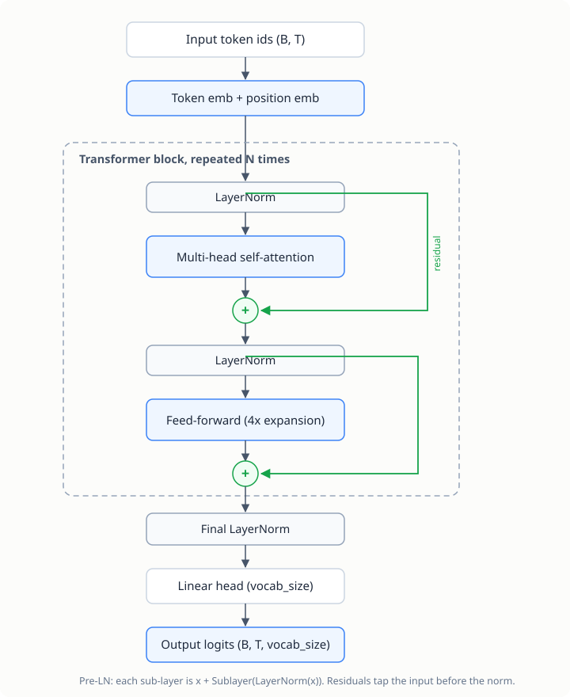
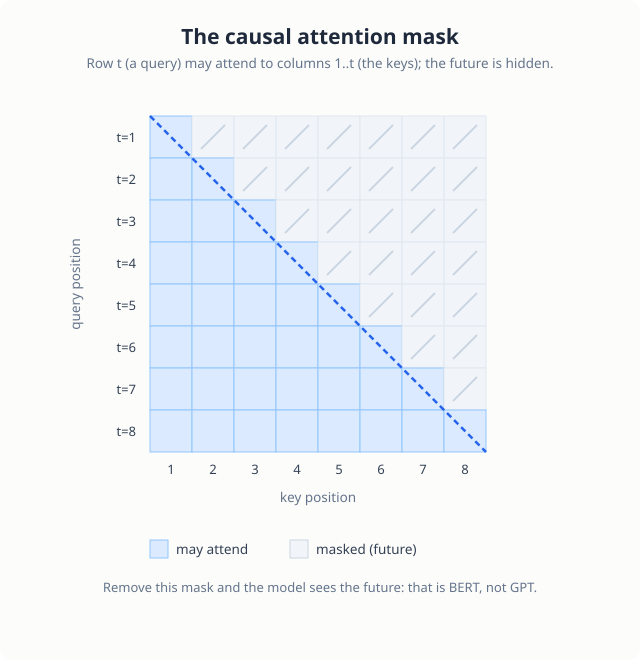
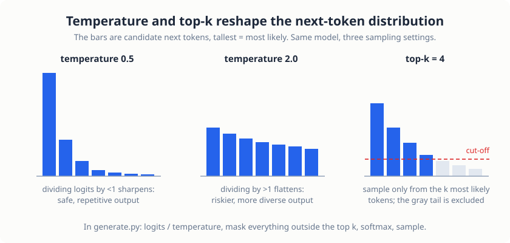

# Character-Level GPT

> **Project source:** [`phase1_foundation/project1_minimal_gpt/`](https://github.com/abubakarsiddik31/llm-from-scratch/tree/main/phase1_foundation/project1_minimal_gpt)
>
> **Papers:** *"Attention Is All You Need"* (Vaswani et al., 2017) · *"Improving Language Understanding by Generative Pre-Training"* (GPT-1, 2018) · *"Language Models are Unsupervised Multitask Learners"* (GPT-2, 2019)

## Objective

Build a GPT model from scratch and train it on Shakespeare. By the end you
will have implemented, without a library doing the work for you:

1. Self-attention, the core mechanism of the transformer
2. Multi-head attention: parallel heads learning different patterns
3. The transformer block: attention and a feed-forward network joined by
   residuals
4. Positional embeddings, so the model has a sense of sequence order
5. The training loop: loss, backpropagation, optimization
6. Text generation with temperature and top-k sampling

## Why start at character level?

| | Character-level | Word/subword level |
|---|---|---|
| Tokenization | Trivial (each character is a token) | Needs BPE (Chapter 2) |
| Vocabulary | ~65 tokens | 50,000+ |
| Time to first result | Minutes | Hours |
| Debugging | You can visually inspect everything | Harder |

The model is small, roughly 10M parameters, and the dataset is about a
million characters, so training finishes in under an hour on a consumer GPU.
That is fast enough to iterate on an idea instead of waiting on it.

## Architecture

<figure class="figure">

<figcaption>The full forward pass. Everything inside the large box is one transformer block, stacked N times.</figcaption>
</figure>

Note the **pre-LN** arrangement: LayerNorm sits *before* each sublayer. That
is the GPT-2 style, and it trains more stably than the original post-LN
design.

## The core ideas

### Self-attention

Every token asks two questions: *what am I looking for?* (its query) and
*what do I contain?* (its key and value).

```
For each token position:
- Query (Q): "What am I looking for?"
- Key (K):   "What do I contain?"
- Value (V): "What information do I provide?"

Attention = softmax(Q × Kᵀ / √d_k) × V
```

The `√d_k` scaling keeps softmax inputs in a healthy range. Without it, the
dot products grow with dimension and softmax saturates.

### Causal masking

GPT generates text left to right, so position *t* may only attend to
positions up to and including *t*. A triangular mask enforces this before the
softmax:

```
- Position 1 sees: [1]
- Position 2 sees: [1, 2]
- Position T sees: [1, 2, ..., T]
```

<figure class="figure">

<figcaption>The attention matrix under a causal mask. Row *t* can look at columns 1 through *t*; everything above the diagonal is masked before the softmax.</figcaption>
</figure>

Remove that one mask and the model can see the future. This is the real
difference between GPT (generation) and BERT (understanding): Chapter 3
removes it.

### Multi-head attention

Instead of one attention computation, we run several in parallel on smaller
projected subspaces. Different heads specialize: one might track syntax,
another pronoun references. Their outputs are concatenated and projected
back.

### Residuals + LayerNorm

Each sub-layer is wrapped as `x = x + Sublayer(LayerNorm(x))`. The residual
gives gradients a highway through the network; the normalization stabilizes
activation scales across depth.

## The code

Everything in this section is the actual repository code. The files in
[`phase1_foundation/project1_minimal_gpt/`](https://github.com/abubakarsiddik31/llm-from-scratch/tree/main/phase1_foundation/project1_minimal_gpt)
carry long commentary docstrings alongside every line; what follows is the
same code with that commentary trimmed so the page stays readable. Excerpts
are condensed and lightly reformatted; the logic matches the repository.

### The attention module

```python
class CausalSelfAttention(nn.Module):
    # PAPER: "Attention Is All You Need", Vaswani et al. (2017), Sections 3.2.1-3.2.2

    def __init__(self, config):
        super().__init__()
        assert config.N_EMBD % config.N_HEAD == 0      # d_model must split evenly across heads
        self.n_head = config.N_HEAD
        self.head_size = config.N_EMBD // config.N_HEAD  # d_k = d_model / h

        # one projection produces Q, K and V together
        self.c_attn = nn.Linear(config.N_EMBD, 3 * config.N_EMBD, bias=False)
        # the W^O output projection from the multi-head formula
        self.c_proj = nn.Linear(config.N_EMBD, config.N_EMBD, bias=False)
        self.attn_dropout = nn.Dropout(config.DROPOUT)
        self.resid_dropout = nn.Dropout(config.DROPOUT)

        # lower-triangular ones: 1 = may attend, 0 = masked out
        self.register_buffer(
            "mask", torch.tril(torch.ones(config.BLOCK_SIZE, config.BLOCK_SIZE))
        )
```

Three decisions trace directly to the papers. The paper's multi-head
formula needs `d_k = d_model / h`, which is why the divisibility assertion
is the first line of the module. The paper projects queries, keys and
values with separate matrices; doing it in one `nn.Linear` and splitting is
mathematically identical and one matrix multiply cheaper, and both GPT-1
and GPT-2 do the same. And the mask is a `register_buffer`, not a
parameter: it must be saved with the model and move to the GPU with it,
but no optimizer should ever touch it.

The forward pass is where the paper's equation (1) lives:

```python
    def forward(self, x):
        B, T, C = x.size()

        # (B, T, C) -> three tensors of (B, T, C): query, key, value
        q, k, v = self.c_attn(x).split(self.n_embd, dim=2)

        # split d_model across heads: (B, T, C) -> (B, n_head, T, head_size)
        k = k.view(B, T, self.n_head, self.head_size).transpose(1, 2)
        q = q.view(B, T, self.n_head, self.head_size).transpose(1, 2)
        v = v.view(B, T, self.n_head, self.head_size).transpose(1, 2)

        # softmax(Q K^T / sqrt(d_k))  -- paper equation (1)
        att = (q @ k.transpose(-2, -1)) * (self.head_size ** -0.5)

        # the causal mask: future positions get -inf, so softmax gives them 0
        att = att.masked_fill(self.mask[:T, :T] == 0, float("-inf"))

        att = F.softmax(att, dim=-1)
        att = self.attn_dropout(att)

        y = att @ v                                        # weighted sum of values
        y = y.transpose(1, 2).contiguous().view(B, T, C)   # concatenate heads
        y = self.resid_dropout(self.c_proj(y))             # the W^O projection
        return y
```

Four lines carry the whole mechanism. `q @ k.transpose(-2, -1)` turns
every token's query against every token's key into a `(T, T)` score
matrix. Multiplying by `head_size ** -0.5` is the `1/√d_k` scaling: without
it, dot products grow with dimension, softmax saturates, and gradients
vanish. `masked_fill` stamps `-inf` into every position that looks into the
future, so that after the softmax those entries are exactly zero. And
`att @ v` is each position collecting a weighted average of the values.
The reshape before and after only exist to give each of the `n_head`
heads its own `head_size`-dimensional slice to work on; the paper's
"concatenate the heads" is the `transpose(...).view(...)` line.

The module returns a tensor with the same shape it received. That is
deliberate and it is what makes the residual connections in the next
section possible: `x = x + Attention(x)` only type-checks if attention
preserves shape.

### The block and the feed-forward network

```python
class FeedForward(nn.Module):
    # PAPER: "Attention Is All You Need", Section 3.3; 4x expansion follows GPT-2
    def __init__(self, config):
        super().__init__()
        self.net = nn.Sequential(
            nn.Linear(config.N_EMBD, 4 * config.N_EMBD),
            nn.ReLU(),
            nn.Linear(4 * config.N_EMBD, config.N_EMBD),
            nn.Dropout(config.DROPOUT),
        )

    def forward(self, x):
        return self.net(x)


class TransformerBlock(nn.Module):
    # PAPER: "Attention Is All You Need", Section 3.1; pre-LN ordering from GPT-2

    def __init__(self, config):
        super().__init__()
        self.attn = CausalSelfAttention(config)
        self.ffwd = FeedForward(config)
        self.ln1 = nn.LayerNorm(config.N_EMBD)
        self.ln2 = nn.LayerNorm(config.N_EMBD)

    def forward(self, x):
        x = x + self.attn(self.ln1(x))   # residual, LayerNorm applied first
        x = x + self.ffwd(self.ln2(x))   # residual, LayerNorm applied first
        return x
```

The forward pass is four lines, and the order of operations in them is the
single most consequential design choice in the file. The original
transformer normalized *after* each sub-layer
(`x = LayerNorm(x + Sublayer(x))`, "post-LN"). GPT-2 moved the norm
*before* the sub-layer (`x = x + Sublayer(LayerNorm(x))`, "pre-LN"), which
leaves a clean identity path from output back to input through the
residuals and trains noticeably more stably as depth grows. Every modern
decoder stacks blocks this way. The `+` is the residual: it gives gradients
a highway, and it means each sub-layer only has to learn a *correction* to
the signal rather than reproduce it.

### The full model

```python
class GPT(nn.Module):
    # PAPERS: GPT-1, Radford et al. (2018); GPT-2, Radford et al. (2019)

    def __init__(self, config):
        super().__init__()
        self.transformer = nn.ModuleDict(
            dict(
                wte=nn.Embedding(config.VOCAB_SIZE, config.N_EMBD),  # tokens
                wpe=nn.Embedding(config.BLOCK_SIZE, config.N_EMBD),  # positions
                drop=nn.Dropout(config.DROPOUT),
            )
        )
        blocks = [TransformerBlock(config) for _ in range(config.N_LAYER)]
        self.transformer.blocks = nn.ModuleList(blocks)
        self.transformer.ln_f = nn.LayerNorm(config.N_EMBD)
        self.lm_head = nn.Linear(config.N_EMBD, config.VOCAB_SIZE, bias=False)

    def forward(self, idx, targets=None):
        device = idx.device
        B, T = idx.shape

        tok_emb = self.transformer.wte(idx)   # (B, T, C): what each token is
        pos = torch.arange(0, T, dtype=torch.long, device=device)
        pos_emb = self.transformer.wpe(pos)   # (T, C): where each token sits
        x = self.transformer.drop(tok_emb + pos_emb)

        for block in self.transformer.blocks:
            x = block(x)

        x = self.transformer.ln_f(x)
        logits = self.lm_head(x)              # (B, T, vocab_size)

        loss = None
        if targets is not None:
            loss = F.cross_entropy(
                logits.view(-1, logits.size(-1)),
                targets.view(-1),
                ignore_index=-1,
            )
        return logits, loss
```

Both embeddings are learned lookup tables. The original transformer
computed positions with fixed sine/cosine patterns; GPT-1 switched to
learned position embeddings, which is simpler and works just as well at
fixed context length. Note the two embeddings are **added**, not
concatenated, so "cat" at position 0 and "cat" at position 5 get different
input vectors while the dimensionality stays at `n_embd`.

The loss line does next-token prediction over the whole sequence at once.
Because of the causal mask, position `t`'s logits were computed without
ever seeing token `t+1`, so the *same* forward pass yields `T` honest
training examples. `logits.view(-1, vocab_size)` flattens batch and time
into one list of predictions, and cross-entropy does the rest.

### Generation

```python
    @torch.no_grad()
    def generate(self, idx, max_new_tokens, temperature=1.0, top_k=None):
        for _ in range(max_new_tokens):
            idx_crop = (
                idx if idx.size(1) <= self.config.BLOCK_SIZE
                else idx[:, -self.config.BLOCK_SIZE :]
            )
            logits, _ = self(idx_crop)
            logits = logits[:, -1, :] / temperature   # only the last position matters

            if top_k is not None:
                v, _ = torch.topk(logits, min(top_k, logits.size(-1)))
                logits[logits < v[:, [-1]]] = -float("Inf")

            probs = F.softmax(logits, dim=-1)
            idx_next = torch.multinomial(probs, num_samples=1)
            idx = torch.cat((idx, idx_next), dim=1)
        return idx
```

Two details are easy to miss. The crop at the top only works *because* the
attention is causal: the next-token prediction depends on the last
`BLOCK_SIZE` tokens and nothing earlier, so discarding the prefix is free.
And the top-k trick is two lines: find the *k*-th largest logit, then set
everything below it to `-inf`, which removes the tail of implausible
tokens from the sampling distribution without changing the ranking of the
survivors.

## Training

```bash
uv run python phase1_foundation/project1_minimal_gpt/train.py
```

Typical trajectory on Shakespeare:

```
step 0:    val loss 4.50   (random predictions)
step 500:  val loss 2.80   (learning patterns)
step 1000: val loss 2.20   (basic structure)
step 2000: val loss 1.90   (coherent text)
step 5000: val loss 1.60   (Shakespeare-like)
```

Expect a validation loss of 1.5–1.8 after roughly 30 minutes to 2 hours on a
GPU.

## Generation

```bash
# Single prompt
uv run python phase1_foundation/project1_minimal_gpt/generate.py \
    --prompt "ROMEO:" --temperature 0.8 --top_k 50

# Interactive mode (supports `temp <x>`, `topk <x>`, `clear`)
uv run python phase1_foundation/project1_minimal_gpt/generate.py --interactive
```

**Temperature** divides the logits before softmax: below 1 sharpens the
distribution (safer, more repetitive), above 1 flattens it (riskier, more
diverse). **Top-k** restricts sampling to the *k* most likely tokens, cutting
off the long tail of implausible continuations.

<figure class="figure">

<figcaption>What each sampling knob does to the next-token distribution.</figcaption>
</figure>

## Code tour

| File | What to read |
|------|--------------|
| [`model.py`](https://github.com/abubakarsiddik31/llm-from-scratch/blob/main/phase1_foundation/project1_minimal_gpt/model.py) | `CausalSelfAttention`, the transformer block, the full GPT class |
| [`train.py`](https://github.com/abubakarsiddik31/llm-from-scratch/blob/main/phase1_foundation/project1_minimal_gpt/train.py) | Batching, loss, the training loop, checkpointing |
| [`generate.py`](https://github.com/abubakarsiddik31/llm-from-scratch/blob/main/phase1_foundation/project1_minimal_gpt/generate.py) | Autoregressive decoding, temperature/top-k |
| [`config.py`](https://github.com/abubakarsiddik31/llm-from-scratch/blob/main/phase1_foundation/project1_minimal_gpt/config.py) | Every hyperparameter, documented |

## Exercises

1. Set the causal mask to identity (no masking) and watch generation collapse
   into nonsense: the model now sees the future.
2. Change `N_HEAD` to 1. How does the loss curve change?
3. Set `temperature` to 0.1 and to 2.0, and compare output quality.

## What's next

The model understands *characters*, not *words*. Chapter 2 builds the
subword tokenizer that real LLMs use.
