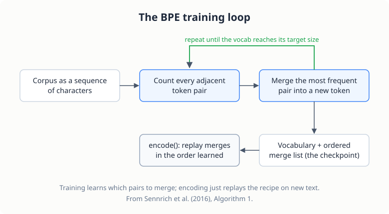

# The BPE Tokenizer

> **Project source:** [`phase1_foundation/project2_tokenizer/`](https://github.com/abubakarsiddik31/llm-from-scratch/tree/main/phase1_foundation/project2_tokenizer)
>
> **Papers:** *"Byte-Pair Encoding: Subword-Based Machine Translation"* (Sennrich, Haddow & Birch, 2016) · *"A New Algorithm for Data Compression"* (Gage, 1994 — original BPE) · WikiText (Merity et al., 2016)

## Why subwords?

Chapter 1's model saw characters: no unknown tokens, but every word cost many
positions of context. Word-level models waste the opposite way: huge
vocabularies and no way to handle unseen words. Byte-Pair Encoding sits in
between, and it is the tokenization used by GPT-2, GPT-3, and most modern
LLMs.

| Approach | Example | Pros | Cons |
|----------|---------|------|------|
| **Character** | `"hello"` → `h e l l o` | No unknowns, tiny vocab | Very long sequences |
| **Word** | `"hello"` → `hello` | Short sequences | Huge vocab, unknowns |
| **BPE** | `"hello"` → `hello`, `"hells"` → `hell · s` | Balanced, handles OOV | Moderate vocab |

Key properties:

1. **Handles OOV**: `"unfriendliness"` → `un · friend · li · ness`
2. **Efficient**: frequent words become single tokens
3. **Compositional**: subwords recur across related words (`help`, `help · ing`, `help · ful`)
4. **No unknowns**: worst case, every text degrades to characters

## The training algorithm

From Sennrich et al. (2016), Algorithm 1:

```
1. Initialize the vocabulary with all unique characters
2. Repeat until the target vocabulary size is reached:
   a. Count the frequency of every adjacent token pair
   b. Find the most frequent pair
   c. Merge it into a new token
   d. Apply the merge everywhere in the corpus
```

<figure class="figure">

<figcaption>The training loop. The order merges were learned in matters later: encoding replays them in that order.</figcaption>
</figure>

Worked example on `"hug hug pug hug pug"`:

| Step | Operation | Vocabulary |
|------|-----------|------------|
| Initial | characters | `{h, u, g, p, ␣}` |
| 1 | merge `u`+`g` → `ug` | `{h, u, g, p, ␣, ug}` |
| 2 | merge `h`+`ug` → `hug` | `{h, u, g, p, ␣, ug, hug}` |
| 3 | merge `p`+`ug` → `pug` | `{h, u, g, p, ␣, ug, hug, pug}` |

After training, encoding is **greedy longest-match-first**: apply the learned
merges in the order they were learned.

```
Learned merges: [('e','r'), ('er','t'), ('ert','a')]
Text: "erter"
Step 1: ['e','r','t','e','r']
Step 2: ['er','t','e','r']      (apply 'e'+'r')
Step 3: ['ert','e','r']         (apply 'er'+'t')
Step 4: ['ert','er']            (apply 'e'+'r')
```

## Scaling the training loop

The naive implementation recounts every adjacent pair across the *entire
corpus* on every merge, which is O(corpus length) per merge. On an 11 MB
WikiText corpus with a 5,000-token vocabulary that measured ~4.7 s/merge:
a 5-hour run.

The fix in this repository is to represent the corpus as **distinct words
with multiplicities** (a `Counter`), so each merge iterates over ~50k unique
words instead of millions of characters, weighting pair counts by word
frequency. Merges still cross the word/space boundary because every word
carries a trailing space into training (so tokens like `"the "` are
learnable).

The result: about 5.8 merges per second, the same run in roughly 12 minutes,
and an identical vocabulary. That's a ~50× speedup for a representation
change, not an algorithm change.

## The code

As in Chapter 1, what follows is the repository's code
([`tokenizer.py`](https://github.com/abubakarsiddik31/llm-from-scratch/blob/main/phase1_foundation/project2_tokenizer/tokenizer.py))
with the commentary docstrings trimmed. Excerpts are condensed and lightly
reformatted; the logic matches the repository.

### The training loop

```python
class BPETokenizer:
    # PAPER: "Byte-Pair Encoding: Subword-Based Machine Translation",
    #        Sennrich et al. (2016), Algorithm 1

    def train(self, text, vocab_size, min_frequency):
        # 1. seed the vocabulary with every character in the corpus
        chars = sorted(list(set(text)))
        for char in chars:
            if char not in self.vocab:
                new_id = len(self.vocab)
                self.vocab[char] = new_id
                self.inverse_vocab[new_id] = char

        # 2. represent the corpus as distinct words with multiplicities
        normalized = " ".join(text.split())
        raw_words = normalized.split(" ")
        word_counts = Counter()
        for w in raw_words[:-1]:
            if w:
                word_counts[w + " "] += 1    # trailing space: word boundaries stay mergeable
        if raw_words and raw_words[-1]:
            word_counts[raw_words[-1]] += 1
        words = [list(w) for w in word_counts.keys()]

        # 3. the merge loop
        num_merges = vocab_size - len(config.SPECIAL_TOKENS) - len(chars)
        for merge_idx in range(num_merges):
            pair_counts = self._get_pair_counts(words, counts=list(word_counts.values()))
            if not pair_counts:
                break
            best_pair = max(pair_counts, key=pair_counts.get)
            if pair_counts[best_pair] < min_frequency:
                break

            new_token = best_pair[0] + best_pair[1]
            new_id = len(self.vocab)
            self.vocab[new_token] = new_id
            self.inverse_vocab[new_id] = new_token
            self.merges.append(best_pair)    # order matters: encode() replays it

            words = self._apply_merge(words, best_pair)
```

The trailing-space line deserves a pause. WikiText-2 is 11 MB of words
separated by whitespace, and BPE counts *adjacent pairs*; if words were
treated as isolated islands, the token `the` could never absorb the space
after it and real tokenizers' `the`-with-trailing-space token would be
unlearnable. Appending the space to every word except the last keeps the
corpus equivalent to one long sequence, minus merges across newlines.

`self.merges.append(best_pair)` looks incidental and is not: encoding a
new string replays the merge list in exactly the order it was learned.
The same pair `(a, b)` merged early is a different operation than merged
late, because what `a` and `b` *are* depends on every merge before it.

### Counting and applying a merge

```python
    def _get_pair_counts(self, words, counts=None):
        # "Count the frequency of each adjacent pair" (Algorithm 1, step 2a)
        if counts is None:
            counts = [1] * len(words)
        pair_counts = Counter()
        for word, count in zip(words, counts):
            for i in range(len(word) - 1):
                pair = (word[i], word[i + 1])
                pair_counts[pair] += count
        return pair_counts

    def _apply_merge(self, words, pair):
        new_token = pair[0] + pair[1]
        new_words = []
        for word in words:
            new_word = []
            i = 0
            while i < len(word):
                if i < len(word) - 1 and word[i] == pair[0] and word[i + 1] == pair[1]:
                    new_word.append(new_token)
                    i += 2                   # both symbols consumed
                else:
                    new_word.append(word[i])
                    i += 1
            new_words.append(new_word)
        return new_words
```

`_apply_merge` scans left to right and consumes two positions on a hit
(`i += 2`), which is how overlapping runs resolve: `['l', 'l', 'l']` under
the merge `('l', 'l')` becomes `['ll', 'l']`, and the third `l` stays
single because the first two were consumed as one token.

The `counts` argument is the entire ~50x optimization from the previous
section. The naive implementation keeps one entry per corpus occurrence
and pays full-corpus cost per merge; passing word frequencies in means a
merge scans ~50k distinct words weighted by how often each occurs, and
the resulting pair counts are identical.

### Encoding and decoding

```python
    def encode(self, text):
        # greedy longest-match-first: replay merges in learned order (Algorithm 2)
        tokens = list(text)
        current = [tokens]
        for pair in self.merges:
            current = self._apply_merge(current, pair)
        final_tokens = current[0]

        token_ids = []
        for token in final_tokens:
            if token in self.vocab:
                token_ids.append(self.vocab[token])
            else:
                for char in token:   # fallback: spell the token out character by character
                    token_ids.append(self.vocab.get(char, config.SPECIAL_TOKENS["<UNK>"]))
        return token_ids

    def decode(self, token_ids):
        text_parts = []
        for token_id in token_ids:
            if token_id in self.inverse_vocab:
                token = self.inverse_vocab[token_id]
                if token in ["<PAD>", "<BOS>", "<EOS>"]:
                    continue
                elif token == "<UNK>":
                    text_parts.append("<UNK>")
                else:
                    text_parts.append(token)
        return "".join(text_parts)
```

Encoding needs no cleverness at all: start from characters, replay every
learned merge in order, look up the IDs. A merge only applies if both of
its symbols exist as adjacent tokens, so replaying in order automatically
produces longest-match-first behavior; the `for` loop *is* the algorithm.
Decoding is the reverse lookup, with the control tokens dropped from the
output text.

## Data and configuration

```bash
# WikiText-2 (~10 MB, good for testing) or WikiText-103 (~500 MB)
uv run python phase1_foundation/project2_tokenizer/download_data.py --size small

# Train (5k vocab trains in minutes; GPT-2 uses 50,257)
uv run python phase1_foundation/project2_tokenizer/train_tokenizer.py --vocab_size 5000

# Round-trip tests + interactive exploration
uv run python phase1_foundation/project2_tokenizer/test_tokenizer.py --interactive
```

## Special tokens

| Token | ID | Purpose |
|-------|----|---------|
| `<PAD>` | 0 | Padding for batching |
| `<UNK>` | 1 | Unknown fallback (rare; BPE covers all bytes) |
| `<BOS>` | 2 | Beginning of sequence |
| `<EOS>` | 3 | End of sequence |

These positional ids matter later: Chapter 3/4's BERT-style models frame
sequences by *position* (0 = pad, 2 = sentence start, 3 = separator).

## What you should observe

- Very common words (`the`, `be`) encode as a single token
- Technical words split meaningfully: `hyper · parameter`, `transform · er`
- Compression of typical English text is ~2.5–3× versus characters

## Code tour

| File | What to read |
|------|--------------|
| [`tokenizer.py`](https://github.com/abubakarsiddik31/llm-from-scratch/blob/main/phase1_foundation/project2_tokenizer/tokenizer.py) | `BPETokenizer.train()` (with the distinct-word optimization), `_apply_merge`, greedy `encode()` |
| [`train_tokenizer.py`](https://github.com/abubakarsiddik31/llm-from-scratch/blob/main/phase1_foundation/project2_tokenizer/train_tokenizer.py) | CLI, checkpoint format |
| [`test_tokenizer.py`](https://github.com/abubakarsiddik31/llm-from-scratch/blob/main/phase1_foundation/project2_tokenizer/test_tokenizer.py) | Round-trip and behavioral tests |

## Exercises

1. Train with `--vocab_size 1000` vs `5000` and compare token counts for the
   same paragraph. Where does the extra vocabulary pay off?
2. Break the round-trip: find an input whose `decode(encode(x)) != x`, and
   explain why.
3. (Hard) Implement incremental pair-count updates (only pairs adjacent to a
   merge site change) and benchmark against the distinct-word approach.

## What's next

Chapter 3 switches from generation to *understanding*: a bidirectional
encoder pre-trained with masked language modeling, using this tokenizer.
