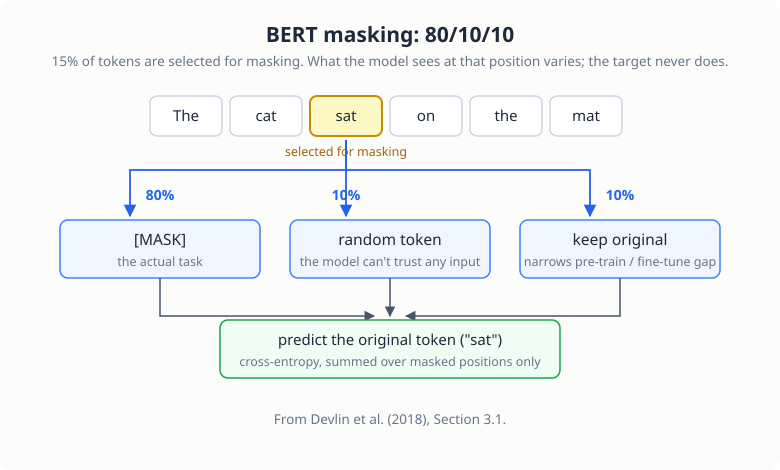

# Contextual Embeddings: BERT from Scratch

> **Project source:** [`phase1_foundation/project3_contextual_embeddings/`](https://github.com/abubakarsiddik31/llm-from-scratch/tree/main/phase1_foundation/project3_contextual_embeddings)
>
> **Papers:** *"BERT: Pre-training of Deep Bidirectional Transformers for Language Understanding"* (Devlin et al., 2018) · *"Attention Is All You Need"* (Vaswani et al., 2017)

## From generation to understanding

GPT is a left-to-right generator: each token sees only its past. For
*understanding* tasks (classification, similarity, retrieval) that is a
handicap. BERT reads in both directions and learns by **predicting words it
cannot see**.

| Aspect | GPT (Chapter 1) | BERT (this chapter) |
|--------|-----------------|---------------------|
| Direction | Unidirectional (causal) | Bidirectional |
| Attention | Causal mask | Full context |
| Pre-training task | Next-token prediction | Masked token prediction |
| Output | Text generation | Contextual embeddings |
| Use case | Generation | Understanding / classification |

## Architecture

```
Input: [CLS] Sentence A [SEP] Sentence B [SEP]
   ↓
Token Embeddings + Position Embeddings + Segment Embeddings
   ↓
Transformer Encoder Blocks × N   (bidirectional self-attention)
   ↓
Output Heads:
  - MLM Head: predict masked tokens  (vocab_size outputs)
  - NSP Head: predict next sentence  (binary output)
```

Two things are new versus Chapter 1:

- **Segment embeddings.** A learned embedding distinguishes "belongs to
  sentence A" from "belongs to sentence B", added to token + position
  embeddings. Sentence A tokens get segment id 0, sentence B tokens id 1.
- **Two heads.** The MLM head projects every position to the vocabulary; the
  NSP head classifies the `[CLS]` position into *is-next / not-next*.

## Pre-training tasks

### Masked Language Modeling (MLM)

The BERT paper masks 15% of tokens, but not always with `[MASK]`:

<figure class="figure">

<figcaption>The 80/10/10 masking scheme. Whatever the input position shows, the training target is the original token.</figcaption>
</figure>

| Probability | Replacement | Why |
|---|---|---|
| 80% | `[MASK]` | The actual task |
| 10% | Random token | Force the model to *not* trust any token |
| 10% | Keep original | There is a mismatch between pre-training and fine-tuning; this reduces it |

The model predicts the *original* tokens at masked positions: cross-entropy
over masked positions only.

### Next Sentence Prediction (NSP)

50% of the time, sentence B genuinely follows A; 50% it is a random sentence.
The model classifies which. *(Later work suggested NSP is not necessary;
RoBERTa dropped it, but we keep it for completeness.)*

## The code

As in the earlier chapters, what follows is the repository's code
([`model.py`](https://github.com/abubakarsiddik31/llm-from-scratch/blob/main/phase1_foundation/project3_contextual_embeddings/model.py)
and
[`train.py`](https://github.com/abubakarsiddik31/llm-from-scratch/blob/main/phase1_foundation/project3_contextual_embeddings/train.py))
with the commentary docstrings trimmed. Excerpts are condensed and lightly
reformatted; the logic matches the repository.

### Bidirectional attention: the one-line difference

```python
class BidirectionalSelfAttention(nn.Module):
    # PAPER: "BERT: Pre-training of Deep Bidirectional Transformers",
    #        Devlin et al. (2018)

    def __init__(self, config):
        super().__init__()
        assert config.N_EMBD % config.N_HEAD == 0
        self.n_head = config.N_HEAD
        self.head_size = config.N_EMBD // config.N_HEAD
        self.c_attn = nn.Linear(config.N_EMBD, 3 * config.N_EMBD, bias=False)
        self.c_proj = nn.Linear(config.N_EMBD, config.N_EMBD, bias=False)
        self.attn_dropout = nn.Dropout(config.DROPOUT)
        self.resid_dropout = nn.Dropout(config.DROPOUT)
        # NOTE: no causal mask buffer. That is the entire difference from GPT.

    def forward(self, x):
        B, T, C = x.size()
        q, k, v = self.c_attn(x).split(self.n_embd, dim=2)
        k = k.view(B, T, self.n_head, self.head_size).transpose(1, 2)
        q = q.view(B, T, self.n_head, self.head_size).transpose(1, 2)
        v = v.view(B, T, self.n_head, self.head_size).transpose(1, 2)
        att = (q @ k.transpose(-2, -1)) * (self.head_size ** -0.5)

        # GPT had, right here:
        #   att = att.masked_fill(self.mask[:T, :T] == 0, float("-inf"))
        # BERT has: nothing. Every token attends to every token.

        att = F.softmax(att, dim=-1)
        att = self.attn_dropout(att)
        y = att @ v
        y = y.transpose(1, 2).contiguous().view(B, T, C)
        y = self.resid_dropout(self.c_proj(y))
        return y
```

The class is Chapter 1's `CausalSelfAttention` with one component deleted.
That is worth internalizing: "bidirectional" is not an added mechanism, it
is the *absence* of a mechanism. What the model can learn with a full
attention matrix is different enough that BERT and GPT end up good at
different things, but structurally the delta is one deleted line and no
mask buffer. (The deleted line also deletes GPT's generation ability: with
no mask, every position sees token `t+1` during training, so "predict the
next token" becomes trivial and useless.)

### Three embeddings summed, and two heads

```python
        self.embeddings = nn.ModuleDict(
            dict(
                token=nn.Embedding(config.VOCAB_SIZE, config.N_EMBD),
                position=nn.Embedding(config.BLOCK_SIZE, config.N_EMBD),
                segment=nn.Embedding(2, config.N_EMBD),   # sentence A or B
                drop=nn.Dropout(config.DROPOUT),
            )
        )
```

```python
        # weight tying (Press & Wolf, 2017): decode with the embedding matrix itself
        self.mlm_head = nn.Linear(config.N_EMBD, config.VOCAB_SIZE, bias=False)
        self.mlm_head.weight = self.embeddings.token.weight
        if config.USE_NSP:
            self.nsp_head = nn.Linear(config.N_EMBD, 2)
```

In the forward pass, the three embedding tables are summed, exactly as
the BERT paper describes its input representation:

```python
        tok_emb = self.embeddings.token(idx)
        pos = torch.arange(0, T, dtype=torch.long, device=device)
        pos_emb = self.embeddings.position(pos)
        if segment_ids is None:
            segment_ids = torch.zeros_like(idx)
        seg_emb = self.embeddings.segment(segment_ids)
        x = self.embeddings.drop(tok_emb + pos_emb + seg_emb)

        for block in self.blocks:
            x = block(x)
        x = self.ln_f(x)

        mlm_logits = self.mlm_head(x)          # (B, T, vocab_size): every position
        nsp_logits = None
        if self.config.USE_NSP:
            cls_output = x[:, 0, :]            # the [CLS] position
            nsp_logits = self.nsp_head(cls_output)
```

The segment embedding is the only new table versus GPT: a two-row lookup
(0 for sentence A, 1 for sentence B) added on top of token and position
embeddings, so the model can tell the two halves of a pair apart. The MLM
head projects *every* position to the vocabulary and is weight-tied to the
token embedding matrix, per Press & Wolf (2017); the NSP head reads only
position 0, the `[CLS]` slot, and answers a two-way question.

### The 80/10/10 masking, in code

```python
def mask_tokens(token_ids, tokenizer_vocab, mask_prob=0.15, mask_token_id=4,
                pad_token_id=0, unk_token_id=1, random_prob=0.1, keep_prob=0.1):
    # PAPER: BERT (2018), Section 3.1
    vocab_size = len(tokenizer_vocab)

    labels = [-100] * len(token_ids)       # -100 = ignore_index: not a target
    masked_token_ids = token_ids.copy()

    special_tokens = {0, 1, 2, 3, 4}       # never mask [PAD]/[UNK]/[CLS]/[SEP]/[MASK]
    valid_indices = [
        i for i, token_id in enumerate(token_ids) if token_id not in special_tokens
    ]
    num_to_mask = max(1, int(len(valid_indices) * mask_prob))
    mask_indices = np.random.choice(
        valid_indices, size=min(num_to_mask, len(valid_indices)), replace=False
    )

    for idx in mask_indices:
        original_token = token_ids[idx]
        labels[idx] = original_token       # the target is ALWAYS the original token

        rand = np.random.random()
        if rand < config.MASK_PROB:                        # 80%: [MASK]
            masked_token_ids[idx] = mask_token_id
        elif rand < config.MASK_PROB + config.RANDOM_PROB: # 10%: random token
            masked_token_ids[idx] = np.random.randint(5, vocab_size)
        else:                                              # 10%: keep original
            masked_token_ids[idx] = original_token

    return masked_token_ids, labels
```

Read the two bookkeeping lines against the figure above. The label array
starts as all `-100` (PyTorch's `ignore_index`), and only the positions
selected for masking get their original token written in; the loss then
ignores everything else:

```python
        mlm_loss = F.cross_entropy(
            mlm_logits.view(-1, mlm_logits.size(-1)),
            masked_labels.view(-1),
            ignore_index=-100,             # only masked positions contribute
        )
```

And why replace with `[MASK]` only 80% of the time rather than always?
Because fine-tuning will never show the model a `[MASK]` token. The random
and keep-original branches force the representation of every position to
stay informative, whether or not the input happens to carry the mask
token.

### Next Sentence Prediction, in code

```python
        idx_a = np.random.randint(0, len(sentences))
        idx_b = np.random.randint(0, len(sentences))
        sent_a, sent_b = sentences[idx_a], sentences[idx_b]

        is_next = np.random.random() < 0.5
        if is_next and idx_a + 1 < len(sentences):
            sent_b = sentences[idx_a + 1]  # the genuine continuation
            label = 1                      # IsNext
        else:
            label = 0                      # NotNext (B stays the random draw above)
```

The pair assembly then brackets the tokens:

```python
        input_pair = [cls_id] + tokens_a + [sep_id] + tokens_b + [sep_id]
        seg_a = [0] * (len(tokens_a) + 2)  # [CLS] and sentence A
        seg_b = [1] * (len(tokens_b) + 1)  # sentence B and the final [SEP]
```

A coin flip decides the label first, and only then is sentence B chosen to
match it: half the time B is replaced by the true continuation, half the
time it stays a random sentence. The segment IDs line up with the bracket
structure, `[CLS] A [SEP] B [SEP]`, which is what the segment-embedding
table from the previous section consumes.

## Configuration

`config.py` documents every choice against the paper. The demonstration
model is deliberately small:

| Hyperparameter | BERT-base | This project |
|---|---|---|
| Layers | 12 | 6 |
| Hidden size | 768 | 256 |
| Heads | 12 | 8 |
| Params | 110M | ~4.8M |
| MLM probability | 15% | 15% |

## Running it

```bash
uv run python phase1_foundation/project3_contextual_embeddings/download_data.py --size small
uv run python phase1_foundation/project3_contextual_embeddings/train.py
```

Checkpoints land in `checkpoints/project3/` as `bert_iter{N}_loss{L}.pt`
containing model + optimizer state and the loss. On the RTX 3050, 10,000
iterations train in about **12 minutes**, with MLM loss falling from 4.2 to
around 1.4.

## Code tour

| File | What to read |
|------|--------------|
| [`model.py`](https://github.com/abubakarsiddik31/llm-from-scratch/blob/main/phase1_foundation/project3_contextual_embeddings/model.py) | `BidirectionalSelfAttention` (no causal mask!), `TransformerEncoderBlock`, the `BERT` class |
| [`train.py`](https://github.com/abubakarsiddik31/llm-from-scratch/blob/main/phase1_foundation/project3_contextual_embeddings/train.py) | `mask_tokens` (the 80/10/10 scheme), NSP pair construction, the training loop |
| [`config.py`](https://github.com/abubakarsiddik31/llm-from-scratch/blob/main/phase1_foundation/project3_contextual_embeddings/config.py) | All hyperparameters with paper quotes |

## Exercises

1. Set `MLM_PROB` to 0.5: how does training stability change?
2. Disable the random-token branch (make it 90/10/0) and compare MLM loss.
3. (Concept) Why can't this model generate text? Trace the forward pass.

## What's next

A pre-trained encoder produces *token* embeddings. Chapter 4 shapes them into
*sentence* embeddings with contrastive learning, where the data augmentation
is dropout itself.
