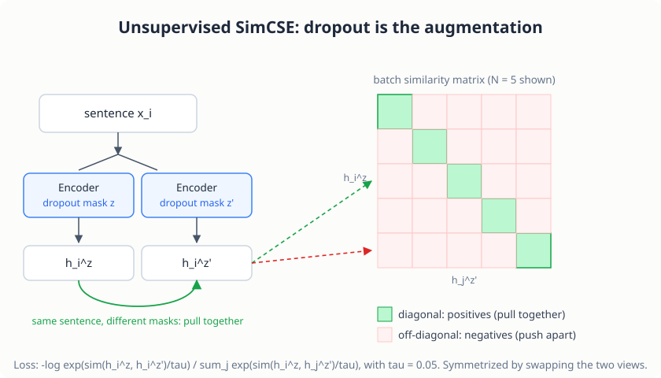

# SimCSE: Sentence Embeddings

> **Project source:** [`phase1_foundation/project3b_simcse/`](https://github.com/abubakarsiddik31/llm-from-scratch/tree/main/phase1_foundation/project3b_simcse)
>
> **Papers:** *"SimCSE: Simple Contrastive Learning of Sentence Embeddings"* (Gao, Yao & Chen, EMNLP 2021) · *"Understanding Contrastive Representation Learning through Alignment and Uniformity on the Hypersphere"* (Wang & Isola, 2020) · STS-B (Cer et al., 2017)

## The problem

Chapter 3's encoder produces contextual *token* embeddings. Downstream tasks
(semantic search, clustering, duplicate detection) need a single vector per
*sentence* where similar sentences end up close together. Averaging the
encoder's outputs doesn't give you that geometry.

SimCSE fixes it with an almost absurdly simple recipe:

> Feed the same sentence into the encoder **twice**. Because dropout masks
> are sampled independently, you get two slightly different embeddings. Train
> the encoder to pull those two together and push every *other* sentence in
> the batch away.

No paraphrase data, no translation pairs. Dropout is the data augmentation.
The paper puts it plainly:

> "dropout acts as minimal data augmentation, and removing it leads to a
> representation collapse."

## The objective

For a mini-batch of *N* sentences (equation 4 of the paper):

```
                  exp(sim(h_i^z, h_i^z')/τ)
l_i = -log -------------------------------------------
           Σ_j exp(sim(h_i^z, h_j^z')/τ)
```

| Symbol | Meaning |
|--------|---------|
| `h_i^z` | Embedding of sentence `x_i` under dropout mask `z` |
| `h_i^z'` | The same sentence under an independent mask `z'` |
| `sim(·,·)` | Cosine similarity |
| `τ` | Temperature, 0.05 for unsupervised SimCSE |

This is an *N*-way classification over the batch: each row of the similarity
matrix must find its own positive on the diagonal. The loss is symmetrized by
swapping the two views.

<figure class="figure">

<figcaption>Unsupervised SimCSE in one picture. The diagonal of the batch similarity matrix holds the positive pairs; everything off it is pushed away.</figcaption>
</figure>

### Why it works: alignment and uniformity

Wang & Isola (2020) characterize good contrastive spaces with two metrics
(both implemented in `model.py`):

- **Alignment**: similar sentences map to nearby points (positives are close)
- **Uniformity**: embeddings spread evenly over the hypersphere

The paper's diagnostic: models with *no* dropout, or with a *fixed* dropout
mask shared by both copies, trivially make the two views identical. Their
alignment collapses to zero but their representations clump, so uniformity
is destroyed and STS-B degrades dramatically. Independent dropout masks keep
alignment steady while still improving uniformity. Starting from a
pre-trained checkpoint matters too: "it provides good initial alignment."

## The "MLP trick"

During training, a one-layer MLP with tanh sits on top of the `[CLS]`
embedding, and the contrastive pressure flows through it. At **evaluation**
the head is discarded and the raw `[CLS]` embedding is used, which is worth
1–2 Spearman points. The intuition: let the loss shape the space through a
disposable projection, leaving the underlying embedding closer to its
pre-trained manifold.

## The code

This is the repository's code
([`model.py`](https://github.com/abubakarsiddik31/llm-from-scratch/blob/main/phase1_foundation/project3b_simcse/model.py),
[`train.py`](https://github.com/abubakarsiddik31/llm-from-scratch/blob/main/phase1_foundation/project3b_simcse/train.py),
[`evaluate.py`](https://github.com/abubakarsiddik31/llm-from-scratch/blob/main/phase1_foundation/project3b_simcse/evaluate.py))
with the commentary docstrings trimmed. Excerpts are condensed and lightly
reformatted; the logic matches the repository.

### Equation 4, in code

```python
def simcse_loss(z1, z2, temperature):
    # PAPER: SimCSE, Gao et al. (2021), equation 4
    z1 = F.normalize(z1, p=2, dim=-1)      # L2-normalize: dot product == cosine
    z2 = F.normalize(z2, p=2, dim=-1)

    sim_12 = z1 @ z2.t() / temperature     # (N, N) scaled cosine similarities
    sim_21 = z2 @ z1.t() / temperature     # the same matrix, views swapped

    labels = torch.arange(z1.size(0), device=z1.device)  # positive of row i is column i

    loss_12 = F.cross_entropy(sim_12, labels)
    loss_21 = F.cross_entropy(sim_21, labels)
    return (loss_12 + loss_21) / 2
```

Map each line onto the formula from the objective section. Normalizing
both views to unit length turns the dot product into cosine similarity.
`z1 @ z2.t()` builds the whole batch similarity matrix at once; dividing
by `τ = 0.05` stretches it twenty-fold, which is what makes off-diagonal
negatives *hard* (their similarities differ by fractions, but after
scaling those fractions are the entire game). The labels are the identity:
row `i` must pick out column `i`, its own re-encoding. And because
`F.cross_entropy` computes `-log softmax` over each row, the denominator
of equation 4, the sum over all `j`, is exactly what softmax normalizes
against. The symmetrization at the end trains both directions.

### The two forward passes

```python
            # Two forward passes = two independent dropout masks (the
            # entire "augmentation" of unsupervised SimCSE)
            z1 = encoder.encode(idx, attention_mask, project=config.USE_MLP_HEAD)
            z2 = encoder.encode(idx, attention_mask, project=config.USE_MLP_HEAD)

            loss = simcse_loss(z1, z2, config.TEMPERATURE)
```

Earlier in the same function there is `encoder.train()  # dropout ON - it IS
the augmentation`. That comment is the whole method: same batch, same
tokens, no other transformation, two calls. Every stochastic layer inside
the encoder (attention dropout, residual dropout, embedding dropout)
resamples its mask independently on each call, and the gap between the two
embeddings is the positive pair the loss pulls together. If the encoder is
put in eval mode, both calls return the identical tensor, the loss is
`log(N)`, and nothing is learned.

### The MLP head and pooling

```python
class MLPHead(nn.Module):
    # PAPER: Gao et al. (2021): "an MLP layer (with one tanh activation) on
    # top of the [CLS] representation ... used only for training but not
    # for evaluation"
    def __init__(self, n_embd):
        super().__init__()
        self.dense = nn.Linear(n_embd, n_embd)
        self.activation = nn.Tanh()

    def forward(self, cls_hidden):
        return self.activation(self.dense(cls_hidden))
```

```python
        if self.pooler == "cls":
            emb = hidden[:, 0, :]              # the [CLS] hidden state
        elif self.pooler == "mean":
            mask = attention_mask.unsqueeze(-1).float()
            emb = (hidden * mask).sum(dim=1) / mask.sum(dim=1).clamp(min=1.0)
        else:
            raise ValueError(f"Unknown pooler: {self.pooler}")

        if project:                            # training only: the MLP trick
            emb = self.mlp_head(emb)
        return emb
```

The `project` flag is where the train/eval asymmetry lives: training
passes route the contrastive pressure through the disposable projection,
evaluation calls `encode(..., project=False)` and uses the raw `[CLS]`
embedding. Mean pooling exists as the comparison baseline; it excludes
`[PAD]` positions via the attention mask so padding cannot dilute the
average.

### Alignment and uniformity

```python
def alignment_and_uniformity(z1, z2, temperature=0.05):
    # Wang & Isola (2020); SimCSE Section 3 uses these to explain WHY dropout works
    z1 = F.normalize(z1, p=2, dim=-1)
    z2 = F.normalize(z2, p=2, dim=-1)

    alignment = (z1 - z2).norm(p=2, dim=-1).pow(2).mean().item()

    all_z = torch.cat([z1, z2], dim=0)
    sq_pdist = torch.pdist(all_z, p=2).pow(2)
    uniformity = (-sq_pdist.mul(-2.0 * temperature).exp().mean().log()).item()
    return alignment, uniformity
```

Both numbers read "lower is better". Alignment is the mean squared distance
between positive pairs; uniformity is a soft measure of how evenly all
embeddings spread over the sphere. They are diagnostics, not losses: the
collapse the paper warns about shows up as alignment crashing toward zero
while uniformity explodes, which is precisely what you observe if you run
the exercise with dropout disabled.

### The evaluation protocol

```python
@torch.no_grad()
def evaluate_stsb(encoder, split="validation", device=None):
    s1, s2, gold = load_sts_b(split)

    emb1 = encode_sentences(encoder, s1, device=device)   # eval mode: dropout OFF
    emb2 = encode_sentences(encoder, s2, device=device)   # no MLP head either

    e1 = F.normalize(torch.from_numpy(emb1), p=2, dim=-1)
    e2 = F.normalize(torch.from_numpy(emb2), p=2, dim=-1)
    cosine = (e1 * e2).sum(dim=-1).numpy()

    spearman = spearmanr(cosine, gold).statistic
    return float(spearman) * 100
```

The three contract points from the paper are all visible here. Dropout is
off (`encode_sentences` calls `encoder.eval()`), so scores are
reproducible. The MLP head is bypassed. And the reported number is
**Spearman**, not Pearson: STS-B quality is judged by whether the model's
*ranking* of sentence pairs agrees with the human ranking, so what matters
is the correlation between ranks, not raw values.

## Evaluation: STS-B

The Semantic Textual Similarity Benchmark (Cer et al., 2017) provides 1,500
dev sentence pairs scored 0–5 by humans. Encode both sentences of every pair
(dropout OFF, deterministic), compute cosine similarity, and report the
**Spearman rank correlation** with the human scores. The paper's BERT-base
result: **82.5** dev Spearman.

> Note: the GLUE *test* split's labels are hidden (leaderboard only), so the
> dev split is the reportable number.

## Results

Trained on 100k Wikipedia sentences, batch 64, τ = 0.05, lr 5e-5, max
sequence length 32, on an RTX 3050:

| Model | STS-B dev Spearman |
|---|---|
| Project 3 MLM encoder, raw `[CLS]` (baseline) | 16.6 |
| SimCSE, 1 epoch | 27.0 |
| **SimCSE, 3 epochs (final)** | **34.7** |
| SimCSE, 5 epochs (overfits) | 33.5 |

That is +18.1 Spearman over the baseline. The paper's number is higher
because their model has 110M parameters and 10⁶ sentences; the *pipeline*
here is theirs, unchanged. Each epoch takes about 26 seconds on the GPU, so
hyperparameter experiments are cheap.

## Running it

```bash
# Sentence corpus + STS-B
uv run python phase1_foundation/project3b_simcse/download_data.py

# Sanity-test the mechanics before training (runs anywhere, seconds)
uv run python phase1_foundation/project3b_simcse/test_model.py

# Train, then evaluate
uv run python phase1_foundation/project3b_simcse/train.py
uv run python phase1_foundation/project3b_simcse/evaluate.py
```

The sanity tests verify the machinery itself: two forward passes with
dropout ON produce *different* embeddings (if not, the positive pair is
degenerate); aligned positives yield lower loss than misaligned ones;
gradients reach both the encoder and the MLP head.

## Code tour

| File | What to read |
|------|--------------|
| [`model.py`](https://github.com/abubakarsiddik31/llm-from-scratch/blob/main/phase1_foundation/project3b_simcse/model.py) | `SimCSEEncoder` (wraps Project 3's BERT), `MLPHead`, `simcse_loss`, `alignment_and_uniformity` |
| [`data.py`](https://github.com/abubakarsiddik31/llm-from-scratch/blob/main/phase1_foundation/project3b_simcse/data.py) | Sentence loading, `[CLS] s [SEP] [PAD]` batching |
| [`train.py`](https://github.com/abubakarsiddik31/llm-from-scratch/blob/main/phase1_foundation/project3b_simcse/train.py) | Two-view training loop, warmup + linear decay |
| [`evaluate.py`](https://github.com/abubakarsiddik31/llm-from-scratch/blob/main/phase1_foundation/project3b_simcse/evaluate.py) | STS-B protocol |
| [`test_model.py`](https://github.com/abubakarsiddik31/llm-from-scratch/blob/main/phase1_foundation/project3b_simcse/test_model.py) | The sanity suite |

## Exercises

1. Turn dropout off (`p=0`) and retrain. Watch the collapse the paper
   predicts (Section 3, Table 3).
2. Swap `[CLS]` pooling for mean pooling. Which wins at this scale?
3. Train on the full extracted corpus (raise `MAX_SENTENCES`): does more
   data close the gap faster than more epochs?

## What's next

Phase 2 applies the same from-scratch discipline to fine-tuning: SFT, LoRA,
and DPO. Phase 3 then makes inference fast: mixed precision, KV-cache, and
Flash Attention.
