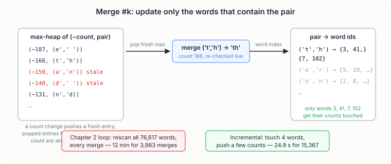
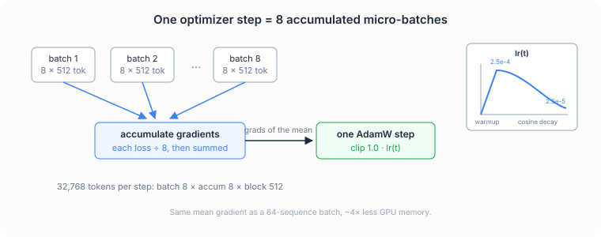

# Pre-Training a 125M GPT

> **Project source:** [`phase1_foundation/project4_pretrain/`](https://github.com/abubakarsiddik31/llm-from-scratch/tree/main/phase1_foundation/project4_pretrain)
>
> **Papers:** *"Language Models are Unsupervised Multitask Learners"* (Radford et al., 2019, GPT-2) · *"Language Models are Few-Shot Learners"* (Brown et al., 2020, GPT-3) · *"Training Compute-Optimal Large Language Models"* (Hoffmann et al., 2022, Chinchilla) · *"FlashAttention"* (Dao et al., 2022) · WikiText (Merity et al., 2016)

## From 10M to 125M

Everything Phase 2 does to a language model (SFT, LoRA, DPO) assumes there
is a base model worth fine-tuning. The chapter 1 GPT, at 10M parameters
trained on 1M characters of Shakespeare, is a demo of the architecture. A
base model needs to have seen two or three orders of magnitude more text.
This chapter builds that model: the same decoder-only stack from
[chapter 1](./ch01-char-gpt.md), scaled up to GPT-2-small class and
pre-trained on WikiText-103.

The target size comes from GPT-2. Its smallest released model has 124M
parameters (12 layers, 768 hidden, 12 heads, 50,257-token BPE vocabulary).
Chinchilla (Hoffmann et al., 2022) says a compute-optimal 124M model wants
roughly 20 tokens per parameter, about 2.5B tokens of training. Our budget
is one RTX 3050 for a few hours, which buys ~131M tokens, about one pass
over WikiText-103. That is 5% of the compute-optimal dose, and the loss
numbers at the end reflect it. The point of the chapter is the machinery;
once it exists, extra tokens are just measured throughput times more
hours.

Counting the parameters exposes a vocabulary problem. GPT-2's 50,257-token
embedding table accounts for 38.6M of its 124M parameters, nearly a third.
Our from-scratch BPE from [chapter 2](./ch02-bpe-tokenizer.md) targets a
16,384-token vocabulary, which makes the embedding table only 12.6M
parameters. Keeping GPT-2's 12 layers would land the model at 98M. Raising
it to 16 layers lands at 126,273,024, GPT-2-small class with our own
tokenizer:

| Component | Count |
|---|---|
| Token embedding `wte` (16,384 × 768, tied with output head) | 12,582,912 |
| Position embedding `wpe` (512 × 768) | 393,216 |
| 16 transformer blocks (7,080,960 each) | 113,295,360 |
| Final LayerNorm | 1,536 |
| **Total** | **126,273,024** |

Depth for vocabulary is a reasonable trade at this scale: GPT-2's own model
family scales depth before width, and attention/MLP widths stay identical
to GPT-2 small. The one behavioral difference is a smaller vocabulary, and
`test_model.py` asserts the total parameter count so the number above stays
honest.

## Training the tokenizer at WikiText-103 scale

Chapter 2's tokenizer needs retraining here, for two reasons. A 5,000-token
vocabulary fragments WikiText-103 into long token sequences, which slows
training directly (more tokens per document). And the corpus is 45× bigger
than WikiText-2, which breaks the training loop itself.

The chapter 2 trainer recomputes pair counts over every distinct word at
every merge. On WikiText-2 that cost ~12 minutes for 3,983 merges, using
the distinct-words-with-multiplicities trick. Scale the corpus 45× and the
merge count 4× and the same loop needs the better part of a day. The
optimizer in `tokenizer.py` keeps the same objective, repeatedly merge the
most frequent adjacent pair, but updates the counts incrementally. Three
data structures do it:

- `pair_counts`: how often each adjacent pair occurs, weighted by word
  frequency
- `pair_to_words`: which word indices contain each pair
- a max-heap of `(-count, pair)` entries for finding the most frequent
  pair without rescanning

At each merge, only words that actually contain the winning pair get
touched. Their old pair contributions are subtracted, the merge is applied
to their symbols, and the new contributions are added back. Everything else
in the corpus is irrelevant to this merge, and the index makes that
literally true instead of approximately.

The heap has one subtlety worth dwelling on. Counts change constantly, and
a heap cannot be updated in place, so the trainer pushes a fresh entry on
every count change and skips stale entries when they pop:

```python
# pop the most frequent pair, skipping stale heap entries
best_pair = None
while heap:
    neg_count, pair = heapq.heappop(heap)
    # fresh only if it still matches the live count
    if pair_counts.get(pair) == -neg_count:
        best_pair = pair
        best_freq = -neg_count
        break
```

An entry is trusted only when its count matches the live `pair_counts`.
That check is also a bug trap: the first version of this loop pushed new
entries only on increments, so a pair whose count had only decreased had
no fresh entry left and became invisible to the trainer even while still
frequent. The naive-vs-incremental test caught it (more on that test
below), and the fix was to push after every change, decrements included.

Ties break differently from chapter 2. There, `max()` over a dict broke
ties by insertion order, which is deterministic but awkward to reproduce in
a test. Here the heap orders by `(-count, pair)`, so among equal counts the
lexicographically smallest pair wins. Different tie-breaks produce
different, equally valid BPE vocabularies; the deterministic one is
testable.

The naive trainer still earns its keep in tests: at test scale it is
cheap, so `test_model.py` implements it as a reference (full rescan every
merge, same lexicographic tie-break) and asserts the merge lists are
identical:

```
✓ Incremental trainer matches naive rescan (116 identical merges)
```

Encoding needed its own fix. Chapter 2's `encode` applies every learned
merge to the whole text, O(merges × length) per call. Fine for a sentence,
hopeless for 540 MB. The standard trick (GPT-2's `encoder.py`, tiktoken)
replaces it: find the adjacent pair with the lowest merge rank, merge all
its occurrences, repeat. This is provably the same result as applying
merges in learned order, because any pair created by merge *k* can only
participate in merges with rank greater than *k*. Per-word memoization on
top means a 540 MB corpus costs one pass plus a few hundred thousand
dictionary lookups.

<figure class="figure">

<figcaption>One merge of the fast trainer. The heap finds the pair without a rescan, stale entries are skipped by comparing against live counts, and the word index means a merge touches only the handful of words containing the pair.</figcaption>
</figure>

The measured gap, on WikiText-2 so both runs see the same corpus:
3,983 merges in ~12 minutes for the chapter 2 loop versus 15,367 merges in
24.9 seconds for the incremental one, more than 100× as many merges per
minute. Training the full 16,384-token tokenizer on a 100 MB sample of
WikiText-103 then takes about two minutes instead of a day.

## The data pipeline

WikiText-103 arrives as three text files (`wiki.train.raw`, 540 MB among
them) organized in articles, with headings on lines that start with
` = `. `prepare_data.py` splits at those heading lines, wraps every
article in `<BOS>` ... `<EOS>`, and encodes it with the tokenizer.

The boundary tokens matter because of a convention inherited from chapter
2: the tokenizer's word normalization collapses all whitespace, so newlines
do not survive encoding. Without explicit `<BOS>`/`<EOS>` the token stream
would be one endless document and the model would never see article
boundaries. The special token IDs (0 = `<PAD>`, 1 = `<UNK>`, 2 = `<BOS>`,
3 = `<EOS>`) are the same ones chapters 3 and 4 build on.

Each split becomes one flat array of `uint16`:

```python
    for doc in tqdm(docs, desc=f"encoding {split_name}", unit="doc"):
        ids.append(BOS)
        ids.extend(tokenizer.encode(doc))
        ids.append(EOS)

    array = np.asarray(ids, dtype=np.uint16)
```

uint16 works because 16,384 < 65,536 (config asserts this), and it halves
the file size versus uint32. GPT-2's 50,257-token vocabulary would not
fit in 16 bits, one more reason the vocabulary choice is not arbitrary.
Training later memory-maps these files and samples random 512-token
windows: no padding, no per-step tokenization, and the corpus never sits
in RAM.

## What changes in the model

The block structure is unchanged from chapter 1: pre-LN, causal
self-attention, 4× GELU MLP, residuals. Three things change, each because
of the scale.

**Fused attention.** Chapter 1 computes attention the way the paper writes
it: scores `QKᵀ/√d_k`, mask, softmax, multiply by V. At this size that
materialized score matrix is the bottleneck. One layer's scores for one
batch are 8 × 12 × 512 × 512 floats, about 100 MB, and backward needs them
per layer. `F.scaled_dot_product_attention` (PyTorch's implementation of
the FlashAttention strategy, Dao et al. 2022) computes the same function
without ever storing the matrix:

```python
        # fused causal attention: softmax(q k^T / sqrt(d_k)) v with the
        # upper triangle masked out. dropout_p regularizes attention
        # weights during training only.
        y = F.scaled_dot_product_attention(
            q, k, v,
            dropout_p=self.attn_dropout if self.training else 0.0,
            is_causal=True,
        )
```

Same math as the chapter 1 version (chapter 1's is kept as the reference
implementation), tiles instead of a materialized matrix.

**Residual-scaled initialization.** GPT-2's released code initializes
weights as Normal(0, 0.02), except the two projections in each block whose
output feeds the residual stream, which get 0.02/√(2·N_LAYER). The reason:
the residual stream accumulates one contribution per layer, so its
variance at initialization grows like depth. Scaling each contribution by
1/√depth keeps the stream's variance flat across 16 layers, cheap
insurance for a stack this deep.

```python
    def _init_weights(self, module):
        if isinstance(module, nn.Linear):
            std = 0.02
            if getattr(module, "_is_residual", False):
                std /= (2 * self.config.N_LAYER) ** 0.5
```

**Weight tying.** The output projection `lm_head` shares its weight matrix
with `wte` (Press & Wolf, 2017; GPT-2 does the same). It saves 12.6M
parameters, the entire vocabulary-sized matrix, and for small-vocabulary
models it usually helps perplexity too.

One more visible choice: no bias terms on the attention and MLP linears.
GPT-2 kept them; GPT-3 and most runs since dropped them with no measurable
loss, and each removed bias is one less thing to allocate and update.

## The training loop

The chapter 1 loop is `batch → forward → backward → step`, and that shape
survives. What changes is the arithmetic around it.

**Gradient accumulation.** GPT-3's smallest model trains on batches of
about 0.5M tokens. An 8 GB card fits perhaps 4,000. Gradient accumulation
splits the logical batch into micro-batches: forward and backward through
8 sequences of 512 tokens at a time, 8 times, summing scaled gradients,
then stepping once. Dividing each loss by the number of micro-batches makes
the accumulated gradient the gradient of the *mean* loss, identical to a
true 64-sequence batch:

```python
        optimizer.zero_grad(set_to_none=True)
        for _ in range(config.GRAD_ACCUM_STEPS):
            x, y = get_batch(train_data, config.BATCH_SIZE, config.BLOCK_SIZE,
                             config.DEVICE)
            with autocast_ctx():
                _, loss = model(x, y)
            # scale so the accumulated gradient equals the mean over all
            # micro-batches, not the sum
            (loss / config.GRAD_ACCUM_STEPS).backward()
        torch.nn.utils.clip_grad_norm_(model.parameters(), config.GRAD_CLIP)
        optimizer.step()
```

That is 32,768 tokens per optimizer step at batch 8, which fits memory
with room to spare.

<figure class="figure">

<figcaption>One optimizer step out of eight micro-batches. The LR schedule inset shows linear warmup to 2.5e-4 followed by cosine decay to 10% of peak.</figcaption>
</figure>

**bf16 mixed precision.** Forward and backward run in bfloat16, master
weights and AdamW moments stay in fp32. bf16 has the same exponent range as
fp32, so activations do not overflow the way they can in fp16, and there is
no loss scaler to tune. The RTX 3050 (Ampere) runs bf16 natively.

**Learning rate schedule.** GPT-3's recipe: linear warmup, then cosine
decay to 10% of peak. Warmup exists because Adam's second-moment estimates
are garbage during the first steps; taking 2.5e-4-sized steps on garbage
variance estimates is how training runs die in iteration 50.

```python
def get_lr(it: int) -> float:
    if it < config.WARMUP_ITERS:
        return config.LEARNING_RATE * (it + 1) / config.WARMUP_ITERS
    if it >= config.MAX_ITERS:
        return config.MIN_LEARNING_RATE
    progress = (it - config.WARMUP_ITERS) / (config.MAX_ITERS - config.WARMUP_ITERS)
    cos = 0.5 * (1 + math.cos(math.pi * progress))
    return config.MIN_LEARNING_RATE + cos * (config.LEARNING_RATE - config.MIN_LEARNING_RATE)
```

Weight decay (0.1) applies to weight matrices only, not to LayerNorm gains,
per GPT-3 Appendix B. Gradient clipping at global norm 1.0 keeps one bad
batch from poisoning the optimizer's moment estimates.

**Checkpointing** keeps the repository-wide five-key format (`iter`,
model, optimizer, train/val loss) in `checkpoint_latest.pt` every 100
steps, with `checkpoint_best.pt` tracking the best validation loss, and
`--resume` continues from the latest snapshot. Loads use
`torch.load(..., weights_only=True)`, which refuses anything but tensors
and primitives.

## Results

The run: 4,000 optimizer steps at 32,768 tokens each, ~131M tokens, one
pass over the 123.5M-token train split. bf16, batch 8 × accumulation 8 ×
block 512. Wall time was 2 hours 36 minutes on the RTX 3050 at a steady
14,100 tokens/second (the smoke estimate from a 3-step run was 5,700;
the first few hundred steps are slower while kernels warm up), using
5.8 GB of the 8 GB of GPU memory.

| Iter | Val loss | Val perplexity |
|---|---|---|
| 0 | 9.83 | ~18,500 |
| 500 | 5.12 | 167 |
| 1,000 | 4.39 | 80.4 |
| 2,000 | 3.73 | 41.8 |
| 3,000 | 3.51 | 33.5 |
| 3,800 (best checkpoint) | **3.39** | **29.5** |
| 3,999 (final) | 3.41 | 30.2 |

Validation loss improved at every evaluation until the last few hundred
steps, where the flat learning rate and the single-pass data budget show up
as small oscillations. The best checkpoint (iter 3,800, val loss 3.385) is
the one to fine-tune from.

Text sampled from `<BOS>` at the end of the run:

> = = History = = This first recorded reference to the song was recorded
> by Paul McCartney at the Abbey Road Abbey in London on 19 April 1967 .
> The song was recorded at the Abbey Road Studios in London in April 1968 .
> ... " Cry Me a New Moon " was the third single from the album .

The register is right: article headings, dated statements, the flat
Wikipedia voice. The facts are confabulated, as they should be for a model
that has seen the equivalent of one pass over its corpus. This is the
checkpoint Phase 2 starts from.

One caution when comparing numbers. GPT-2's paper reports 37.5 perplexity
on WikiText-103 for the 124M model. Our 30.2 is *not* better than that:
GPT-2's number is zero-shot, evaluating on WikiText-103 a model trained on
a different corpus (WebText) with a different tokenizer, while ours is
in-domain, trained on WikiText-103 with a tokenizer trained on the same
corpus. The two setups answer different questions, and the honest summary
of ours is: 131M tokens took a 126M parameter model from random (perplexity
~18,500) to 30, on one consumer GPU in an afternoon. The Chinchilla-optimal
run would need ~2.5B tokens, about 19× more, which at 14,100 tokens/second
is roughly 50 hours of the same GPU.

## Running it

```bash
# 1. corpus (~190 MB download)
uv run python phase1_foundation/project4_pretrain/download_data.py --size full
#    (--size small fetches WikiText-2-raw, ~5 MB, for smoke tests)

# 2. tokenizer (16,384 vocab from a seeded 100 MB sample)
uv run python phase1_foundation/project4_pretrain/train_tokenizer.py

# 3. encode splits to uint16 token files
uv run python phase1_foundation/project4_pretrain/prepare_data.py

# 4. sanity-check everything
uv run python phase1_foundation/project4_pretrain/test_model.py

# 5. pre-train (default 4,000 steps; interrupt-safe)
uv run python phase1_foundation/project4_pretrain/train.py
uv run python phase1_foundation/project4_pretrain/train.py --resume   # continue

# 6. sample
uv run python phase1_foundation/project4_pretrain/generate.py --prompt "The theory"
```

The sanity tests verify the parts that are hard to see from loss curves:
the incremental trainer produces exactly the naive algorithm's merge list,
the rank-based encoder equals ordered-merge encoding, future tokens cannot
change past logits, and a checkpoint round-trips to identical logits.

## Code tour

| File | What to read |
|------|--------------|
| [`config.py`](https://github.com/abubakarsiddik31/llm-from-scratch/blob/main/phase1_foundation/project4_pretrain/config.py) | Every hyperparameter with its paper reference; the 12→16 layer note |
| [`tokenizer.py`](https://github.com/abubakarsiddik31/llm-from-scratch/blob/main/phase1_foundation/project4_pretrain/tokenizer.py) | Incremental BPE trainer (heap + lazy deletion), rank-based encode |
| [`train_tokenizer.py`](https://github.com/abubakarsiddik31/llm-from-scratch/blob/main/phase1_foundation/project4_pretrain/train_tokenizer.py) | Seeded corpus sampling |
| [`prepare_data.py`](https://github.com/abubakarsiddik31/llm-from-scratch/blob/main/phase1_foundation/project4_pretrain/prepare_data.py) | Document boundaries, uint16 bins |
| [`model.py`](https://github.com/abubakarsiddik31/llm-from-scratch/blob/main/phase1_foundation/project4_pretrain/model.py) | SDPA attention, GPT-2 init, weight tying |
| [`train.py`](https://github.com/abubakarsiddik31/llm-from-scratch/blob/main/phase1_foundation/project4_pretrain/train.py) | bf16 + accumulation loop, warmup/cosine, checkpointing |
| [`generate.py`](https://github.com/abubakarsiddik31/llm-from-scratch/blob/main/phase1_foundation/project4_pretrain/generate.py) | Sampling CLI |
| [`test_model.py`](https://github.com/abubakarsiddik31/llm-from-scratch/blob/main/phase1_foundation/project4_pretrain/test_model.py) | The sanity suite, incl. incremental-vs-naive equivalence |

## Exercises

1. Set `BLOCK_SIZE = 1024` (GPT-2's value) and re-measure throughput. Is
   the halving from the context length or the attention matrix?
2. Train a 32,768-token tokenizer. How much does compression (characters
   per token) improve, and what does it cost in embedding parameters if
   you keep 16 layers?
3. Overfit one batch on purpose (batch 2, one repeated window, a few
   hundred steps). Confirm the loss approaches zero; if it doesn't, the
   pipeline has a bug no schedule can fix.
4. The model is 5% of Chinchilla-optimal on tokens. Estimate (from the
   measured tokens/s) how many days 2.5B tokens takes, then estimate what
   a 4-layer 30M version would need. Which direction would you scale
   first?

## What's next

Phase 2 starts with this checkpoint: supervised fine-tuning on
instruction data (Project 5), then LoRA (Project 6) and DPO (Project 7)
all attach to the base model trained here.
