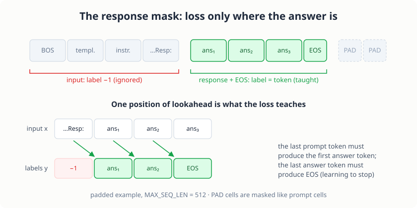

# Supervised Fine-Tuning

> **Project source:** [`phase2_finetuning/project5_sft/`](https://github.com/abubakarsiddik31/llm-from-scratch/tree/main/phase2_finetuning/project5_sft)
>
> **Papers:** *"Training Language Models to Follow Instructions with Human Feedback"* (Ouyang et al., 2022, InstructGPT) · *"Stanford Alpaca: An Instruction-following Llama Model"* (Taori et al., 2023) · *"Self-Instruct: Aligning Language Models with Self-Generated Instructions"* (Wang et al., 2023) · *"Finetuned Language Models Are Zero-Shot Learners"* (Wei et al., 2022, FLAN) · *"LIMA: Less Is More for Alignment"* (Zhou et al., 2023)

## The base model can only continue

Ask the chapter 5 model "What is the capital of France?" and it does the
only thing it was ever taught: it continues the text. Somewhere in its
training distribution a passage listing cities follows, and that is what
you get, in Wikipedia's dated voice, with confabulated facts. The model
is not broken. It has simply never seen a question that expected an
answer.

Fixing this is the first stage of the alignment recipe from InstructGPT
(Ouyang et al., 2022): collect (instruction, response) pairs, fine-tune
the base model on them (SFT), then train a reward model and optimize
against it (RLHF, projects 7 and beyond in spirit). This chapter builds
stage one. LoRA and DPO in the coming chapters attach to the checkpoint
this one produces.

The appealing surprise is how little changes. The architecture moves not
at all: `model.py` in project 5 is the same code as project 4, and the
parameter count stays 126,273,024. What changes is the data, the loss
mask, and the learning rate. SFT is a nudge, a few percent as many
optimizer steps as pre-training, applied to weights that already sit in a
good basin. The nudge is what makes a text-continuer into something that
answers.

## Instruction data: 52,000 Alpaca triples

The dataset is Stanford Alpaca (Taori et al., 2023): 52,002 triples of
`instruction`, optional `input`, and `output`, generated with
Self-Instruct (Wang et al., 2023) from 175 seed tasks written by hand.
The instruction asks for something, the input supplies optional context,
the output is the desired response:

```text
instruction: What is the capital of France?
input:       (empty)
output:      The capital of France is Paris.
```

Twenty-eight entries have empty outputs and carry no supervised signal,
so 51,974 survive. A seeded shuffle holds out the last 1,000 for
validation: 50,973 train, 1,000 val. Averages on the train split: 65.8
prompt tokens and 70.3 response tokens per example, 0.003% `<UNK>`. The
whole set encodes in about 33 seconds at roughly 1,600 examples per
second, because the chapter 4 tokenizer memoizes per-word encodings.

Each triple renders into one prompt with Alpaca's plain-text markers:

```text
Below is an instruction that describes a task. Write a response that
appropriately completes the request.

### Instruction:
What is the capital of France?

### Response:
```

No new special tokens. Adding `<|assistant|>`-style markers would force
an embedding-table resize, which touches the base model's weights before
training even starts. The base tokenizer read 100 MB of English prose in
[chapter 5](./ch05-pretrain.md) and knows every character in `###
Instruction:` already, so plain-text markers cost nothing and "SFT
attaches to the base model unchanged" stays literally true. The
termination signal does use a reserved token: a `<EOS>` (id 3) after the
response, which the sampler learns to listen for.

One honest limitation, inherited from the tokenizer: it normalizes
whitespace, because WikiText is a word stream and
[chapter 5's](./ch05-pretrain.md) `prepare_data.py` added document
boundaries explicitly. Every formatted example therefore encodes as one
long line. The `###` markers carry the structure; the model never learns
newline placement. Code-heavy Alpaca outputs decode as run-on text. A
tokenizer with byte-level fallback and preserved newlines is the fix, and
it is deliberately left to a later project.

## The response mask

Pre-training computes the loss at every position: each token predicts the
next one, and the model learns the statistics of the whole stream,
prompts included. Keep that objective for instruction data and the model
learns something you did not ask for: that a `### Response:` block is
usually followed by another `### Instruction:` block. It memorizes the
format of the conversation and keeps writing new instructions after
answering, because that is what the loss rewarded.

SFT computes the loss on the response only. The mechanism already exists
in the [chapter 1](./ch01-char-gpt.md) loss: `F.cross_entropy` takes an
`ignore_index`, and positions whose target is `-1` contribute nothing.
So each example becomes two aligned arrays:

- `tokens`: `<BOS>`, the prompt, the response, `<EOS>`, then `<PAD>` up
  to length 512
- `labels`: `-1` everywhere except the response and the `<EOS>`, which
  carry the token to teach

The training batch applies the same shift as every chapter: input
position `t` holds token `t`, target position `t` holds the label for
token `t + 1`. Two consequences worth pausing on. The last prompt token
must predict the first response token, which is exactly the skill
"answer the question". And the last response token must predict `<EOS>`,
which is exactly the skill "know when to stop".

<figure class="figure">

<figcaption>The response mask. Prompt and padding positions teach nothing; the response positions and the trailing <code>&lt;EOS&gt;</code> teach answering and stopping.</figcaption>
</figure>

A real example, encoded with the chapter 5 tokenizer: the prompt above
(49 prompt tokens), the response "The capital of France is Paris." (8
response tokens), 59 real positions including `<BOS>` and `<EOS>`. The
taught span is positions 50 through 58, nine positions, and decoding
exactly those label positions gives back "The capital of France is
Paris.". Everything before position 50 is input.

Both papers behind this project agree the loss matters and disagree on
where it applies. InstructGPT computes the SFT loss only on assistant
tokens; Alpaca's released code trains on the full sequence, prompt
included, and works anyway. `train.py --loss_on {response,full}` makes
the comparison one flag (default: `response`); exercise 1 runs it.

### The trailing-space junction

Masking needs to know where the response starts, and our tokenizer makes
that subtle. Its tokens include trailing spaces ("the " is one token),
and a word encodes differently depending on whether another word follows
it: `Response:` at the end of a string and `Response: ` mid-stream are
different token sequences. Splicing token lists by position, encoding
the prompt and hoping it is a prefix of the full encoding, breaks at
exactly this junction. Measured on the example above:

```text
encode(prompt) is a prefix of encode(prompt + " " + output):  False
encode_words(prompt, final=False) + encode_words(response, final=True)
        == encode(prompt + " " + output):                     True
```

So `template.encode_labeled()` splits both halves into words and encodes
each with the trailing-space convention applied explicitly: every prompt
word keeps its trailing space (the response always follows it), only the
final response word drops it. Because encoding is per-word and
context-free, the concatenation is exactly the one-shot encoding of the
whole text, and `test_model.py` asserts that identity so the guarantee
cannot rot silently.

## Attaching to the base checkpoint

Training starts from `checkpoints/project4/model_final.pt` (iter 3,999,
val loss 3.408), loaded with the same `weights_only=True` discipline as
every checkpoint in this repository:

```python
ckpt = torch.load(path, map_location="cpu", weights_only=True)
arch = ckpt.get("config")
...
model = GPT(GPTConfig(
    VOCAB_SIZE=arch["VOCAB_SIZE"],
    N_EMBD=arch["N_EMBD"],
    N_HEAD=arch["N_HEAD"],
    N_LAYER=arch["N_LAYER"],
    BLOCK_SIZE=arch["BLOCK_SIZE"],
    DROPOUT=arch.get("DROPOUT", 0.0),
))
model.load_state_dict(ckpt["model_state_dict"])
```

No key translation is needed anywhere in that load, which is the point
of keeping `model.py` code-identical to project 4's.

The optimizer starts fresh even though the weights do not. AdamW's
second-moment estimates describe the pre-training gradient landscape and
mean nothing about the fine-tuning one, so the first steps get a short
warmup (100 iterations) for the same reason pre-training did.

The learning rate drops from 2.5e-4 to 2e-5, Alpaca's setting and a 12x
reduction. The base weights encode a distribution that took 131M tokens
to learn; a few large steps damage it faster than the new behavior can
replace it, which is the catastrophic-forgetting trap. Three epochs over
51k examples is short enough that overfitting, not underfitting, is the
failure mode to watch, so the loop tracks a val estimate every 100 steps
and keeps `checkpoint_best.pt` by val loss. The rest of the loop is the
chapter 5 skeleton unchanged: bf16 autocast, gradient accumulation
(8 x 8 = 64 examples per step), grad clipping at 1.0, cosine decay to
10% of peak, five-key checkpoints. Dropout stays at 0.0 for the same
reason as pre-training: the schedule is short and the data is not tiny.

## The code

### Encoding one example

`template.py` owns the template and the mask arithmetic. Everything
downstream (prepare, train, generate, tests) goes through it:

```python
prompt_ids = tokenizer.encode_words(prompt_text.split(), final=False)
response_ids = tokenizer.encode_words(output.split(), final=True)

response_start = len(prompt_ids) + 1
if response_start + 2 > max_seq_len:  # +2: one response token + <EOS>
    raise ValueError(
        f"prompt needs {response_start} of {max_seq_len} positions; "
        f"no room for a response"
    )

tokens = [bos] + prompt_ids + response_ids
if len(tokens) >= max_seq_len:
    # truncate the RESPONSE to fit; the prompt stays intact and <EOS>
    # closes whatever response remains
    tokens = tokens[:max_seq_len - 1] + [eos]
else:
    tokens.append(eos)
tokens = tokens + [pad] * (max_seq_len - len(tokens))

labels = [-1] * len(tokens)
for i in range(response_start, len(tokens)):
    if tokens[i] != pad:
        labels[i] = tokens[i]
return tokens, labels
```

Truncation cuts the response, never the prompt. Losing the end of an
answer is acceptable; losing the question is not.

### Building the batch

The shift happens at batch time in `train.py`, and the loss mode is a
one-line switch:

```python
idx = np.asarray(indices, dtype=np.int64)
x = rows[idx][:, :-1].astype(np.int64)
y = (labels[idx][:, 1:] if loss_mode == "response" else rows[idx][:, 1:]).astype(np.int64)
return torch.from_numpy(x).pin_memory(), torch.from_numpy(y).pin_memory()
```

`loss_mode == "full"` simply drops the mask: targets become the raw
tokens, Alpaca's own choice. One subtlety the tests pin down: the numpy
`.astype` returns a fresh C-contiguous copy, which `model.forward`'s
fused cross-entropy requires (it calls `.view(-1)` on the targets, and
`.view` refuses non-contiguous tensors).

### The training step

Per optimizer step, one shuffled chunk of 64 examples walks through 8
micro-batches. The model call is unchanged from chapter 5; the mask
rides inside `y`:

```python
chunk = perm[s * examples_per_step:(s + 1) * examples_per_step]
optimizer.zero_grad(set_to_none=True)
for m in range(config.GRAD_ACCUM_STEPS):
    micro = chunk[m * config.BATCH_SIZE:(m + 1) * config.BATCH_SIZE]
    x, y = get_batch(arrays, micro, loss_mode, config.DEVICE)
    with autocast_ctx():
        _, loss = model(x, y)
    # scale so the accumulated gradient equals the mean over all
    # micro-batches, not the sum
    (loss / config.GRAD_ACCUM_STEPS).backward()
```

### Sampling with a stop condition

`model.generate()` samples a fixed number of tokens and has no opinion
about `<EOS>`; the pre-training model had no reason to emit it mid-stream.
After SFT the model ends its turn with `<EOS>`, so `generate.py` runs its
own sampler that listens:

```python
# the prompt must be encoded exactly as it was during training:
# every word keeps its trailing space (see the junction above)
prompt_ids = tokenizer.encode_words(prompt_text.split(), final=False)
idx = torch.tensor([prompt_ids], dtype=torch.long, device=device)
eos = config.SPECIAL_TOKENS["<EOS>"]

generated: List[int] = []
for _ in range(max_new_tokens):
    ...
    probs = torch.softmax(logits, dim=-1)
    next_id = int(torch.multinomial(probs, num_samples=1))
    if next_id == eos:
        break
    generated.append(next_id)
    idx = torch.cat((idx, torch.tensor([[next_id]], device=device)), dim=1)

return tokenizer.decode(generated)
```

Without that listener the model would answer the question and then keep
writing a fresh `### Instruction:` block forever, the failure every
pre-SFT sampling run shows. The prompt encoding uses the word-by-word
route on purpose: `encode(prompt_text)` would treat the final `Response:`
as text-final and drop the trailing space the model always saw at
training time.

## Running it

```bash
uv run python phase2_finetuning/project5_sft/download_data.py --size full
uv run python phase2_finetuning/project5_sft/prepare_data.py
uv run python phase2_finetuning/project5_sft/test_model.py
uv run python phase2_finetuning/project5_sft/train.py
uv run python phase2_finetuning/project5_sft/generate.py --instruction "Give three tips for staying healthy."
```

`test_model.py` runs 11 tests, the load-bearing ones being: the
word-by-word encoding equals the one-shot encoding of the full text; the
taught span is exactly response + `<EOS>` and survives the shift; a
batch with a single taught position scores exactly that position; the
base checkpoint loads into project 5's model class with all
126,273,024 parameters; and the EOS sampler stops when it should.

## Results

Defaults: response-only loss, base = project 4 checkpoint, the 50,973
example train split, 2,400 steps (153,600 example visits, about 3.0
passes over the data). All numbers measured on the RTX 3050.

| Metric | Value |
|---|---|
| Wall time | ~1 h 42 min (bf16, ~2.5 s/step incl. eval + snapshot writes) |
| GPU memory | ~5.8 GB of 8 GB |
| Val loss (response tokens), base model | 4.994 |
| Val loss after 100 steps | 3.708 |
| Val loss after 400 steps (half of epoch 1) | 3.168 |
| Val loss after 800 steps (end of epoch 1) | 2.954 |
| Final val loss (2,400 steps) | **2.766** (perplexity 15.9) |
| Best checkpoint | iter 2,300, val 2.769 |

The shape of that curve says the useful things. Most of the gain lands in
epoch 1 (4.99 to 2.95); epochs 2 and 3 grind out another 0.19 with the
val curve monotonically down, so at 126M parameters and 51k examples,
three epochs never reached the overfitting the schedule watches for. For
calibration, the base model's val loss on its own pre-training corpus
was 3.41; on Alpaca responses it started at 4.99, because answering is
still out of distribution for it.

Before fine-tuning, here is what the base model produced for the France
question when handed the full template (temperature 0.7):

> Below is an instruction that describes a task. Write a response that
> appropriately completes the request. ### Instruction: What is the
> capital of France? ### Response:= = = = Contents of the House = = = =
> The House of Representatives, or Contents of the House, are the
> largest in the Senate, which is the largest in the House of
> Representatives ...

It continues the prompt into WikiText. After 1 h 42 min of SFT, the same
model answers, and stops:

> **Q: Give three tips for staying healthy.**
> A: Three tips for staying healthy: 1. Make a meeting with a group of
> people who are willing to go to school or any other activities or
> activities that you want to do to ensure you are taking the time to
> spend and the time to teach you the time to teach your thoughts and
> take a sleep during the day.
>
> **Q: What is the capital of France?**
> A: The capital of France is France, with a population density of 8.9
> per square kilometers.
>
> **Q (with `### Input:` "She walks to school."):** Rewrite this
> sentence in past tense
> A: She walks to school.

What the run bought and what it did not. The model learned the
interaction format: it produces an answer-shaped span where the template
asks for one, and it emits `<EOS>` to end its turn, so sampling stops
cleanly instead of writing a fresh `### Instruction:` block. The content
is another matter. The tips are grammatical confabulation; the France
answer is answer-shaped and wrong; the past-tense instruction returned
its own input unchanged, which says the model matches the surface format
of an instruction without reliably computing the requested
transformation. That is the honest ceiling of 126M parameters that saw
131M tokens of pre-training, fine-tuned for 1.7 hours: the machinery
demonstrates itself, the facts do not hold. The full-sequence loss
variant (Alpaca's choice) is one flag away as exercise 1.

## Code tour

| File | What to read |
|------|--------------|
| [`config.py`](https://github.com/abubakarsiddik31/llm-from-scratch/blob/main/phase2_finetuning/project5_sft/config.py) | SFT hyperparameters with paper references; InstructGPT vs Alpaca loss note |
| [`template.py`](https://github.com/abubakarsiddik31/llm-from-scratch/blob/main/phase2_finetuning/project5_sft/template.py) | The Alpaca template, `encode_labeled()`, the trailing-space junction |
| [`tokenizer.py`](https://github.com/abubakarsiddik31/llm-from-scratch/blob/main/phase2_finetuning/project5_sft/tokenizer.py) | Load-only tokenizer; `encode_words()` for the word-by-word prompt route |
| [`model.py`](https://github.com/abubakarsiddik31/llm-from-scratch/blob/main/phase2_finetuning/project5_sft/model.py) | Same GPT as project 4, AST-identical code, SFT notes in docstrings |
| [`download_data.py`](https://github.com/abubakarsiddik31/llm-from-scratch/blob/main/phase2_finetuning/project5_sft/download_data.py) | Allow-listed download; seeded 2,000-example smoke subset |
| [`prepare_data.py`](https://github.com/abubakarsiddik31/llm-from-scratch/blob/main/phase2_finetuning/project5_sft/prepare_data.py) | Encode to tokens + labels, seeded train/val split, skip accounting |
| [`train.py`](https://github.com/abubakarsiddik31/llm-from-scratch/blob/main/phase2_finetuning/project5_sft/train.py) | Base checkpoint loading, masked loss, epochs, checkpoints, resume |
| [`generate.py`](https://github.com/abubakarsiddik31/llm-from-scratch/blob/main/phase2_finetuning/project5_sft/generate.py) | Template-conditioned sampling with the `<EOS>` stop |
| [`test_model.py`](https://github.com/abubakarsiddik31/llm-from-scratch/blob/main/phase2_finetuning/project5_sft/test_model.py) | Encoding identity, mask semantics, NaN edge, base load, EOS stop |

## Exercises

1. Run `--loss_on full` and compare val losses and samples against the
   response-only run. Alpaca trained this way on purpose; does the
   difference show up in a 126M model?
2. Sample the same instruction at temperature 0.2 and 1.0. Where does
   the low-temperature answer stop making sense, and what does that say
   about how peaked the learned response distribution is?
3. LIMA (Zhou et al., 2023) argues 1,000 curated examples nearly match
   52k noisy ones. Subsample 1,000 examples, keep the step count, and
   compare. (Watch the val loss: fewer examples at the same steps is
   more visits per example.)
4. Teach the model newlines: extend the tokenizer with a `<NL>` token
   mapped to a reserved id, re-encode, and continue training. What
   breaks in the embedding table, and what does that cost?
5. Overfit 100 examples on purpose (same batch every step). Confirm val
   loss climbs while train loss approaches zero, and find the step where
   `checkpoint_best.pt` stopped being overwritten.

## What's next

SFT updated all 126M parameters to teach a new behavior. LoRA
(project 6) freezes the base weights and learns small low-rank update
matrices instead, which cuts trainable parameters and optimizer memory
by orders of magnitude at this scale, and DPO (project 7) replaces the
reward-model stage of the alignment recipe with a direct preference
loss. Both start from this chapter's checkpoint.
