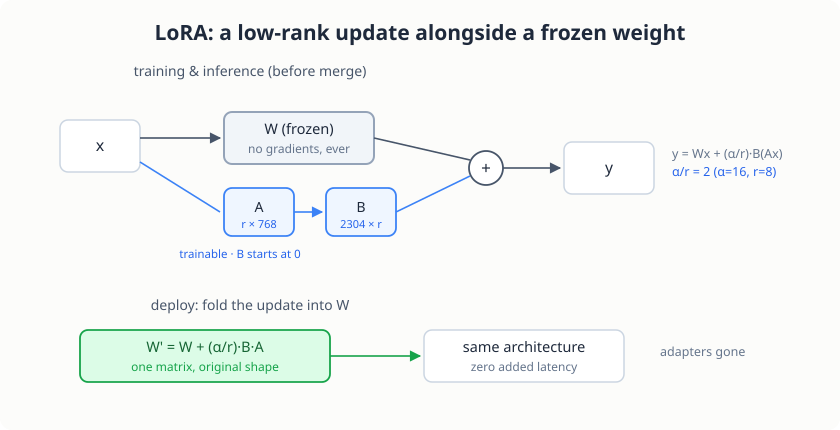

# Low-Rank Adaptation (LoRA)

> **Project source:** [`phase2_finetuning/project6_lora/`](https://github.com/abubakarsiddik31/llm-from-scratch/tree/main/phase2_finetuning/project6_lora)
>
> **Papers:** *"LoRA: Low-Rank Adaptation of Large Language Models"* (Hu et al., 2021) · *"Training Language Models to Follow Instructions with Human Feedback"* (Ouyang et al., 2022, InstructGPT) · *"Stanford Alpaca"* (Taori et al., 2023) · *"Language Models are Few-Shot Learners"* (Brown et al., 2020, GPT-3)

## The full fine-tune is the expensive part

[Chapter 6](./ch06-sft.md) taught the base model to answer instructions by
updating all 126,273,024 parameters. The updated weights were the point,
but they were also the cost. AdamW keeps two fp32 moment buffers per
trainable parameter, so the optimizer state alone is ~2x the model, about
a gigabyte here. And every task you adapt for needs its own full weight
copy: instruction-following, then summarization, then code, each 500 MB of
deltas to store and ship.

LoRA (Hu et al., 2021) starts from an empirical observation about what
full fine-tuning actually does: the change in the weights, dW, has a low
intrinsic rank for adaptation tasks. The task-specific adjustments live
in a small subspace of the weight space. So make that assumption
structural: do not learn dW directly, learn a factorization

    dW = B @ A,    A is r x k,  B is d x r,  r << min(d, k)

and run the layer as

    y = W x + (alpha / r) * B (A x)

with W frozen. The trainable count per adapted matrix drops from d x k to
r x (d + k). On GPT-3, the paper matches full fine-tuning quality with
10,000x fewer trainable parameters, which is the result the method is
named for.

The numbers at our scale, with the paper's rank r = 8 and scale
alpha = 16, adapting the fused QKV projection `c_attn` (768 -> 2304) in
every one of the 16 blocks:

| Component | Full fine-tune (ch06) | LoRA (this chapter) |
|---|---|---|
| Trainable parameters | 126,273,024 | 393,216 (0.311%) |
| AdamW optimizer state | ~1.0 GB | ~3.1 MB |
| Per-matrix cost | 768 x 2304 = 1.77M | 8 x (768 + 2304) = 24,576 |
| Adapted matrices | all | 16 x `c_attn` |

Per matrix, the update compresses 72x: 1.77M numbers become 24,576. Sixteen
wrapped modules gives 393,216 trainable parameters, and
`test_model.py` asserts that exact count so the table stays honest.

<figure class="figure">

<figcaption>The LoRA layer. The frozen weight keeps its gradients off; only the thin A and B train. At deploy the product folds into W and the adapters disappear.</figcaption>
</figure>

## The paper's two initialization rules

One detail makes LoRA workable, and it is worth slowing down for. At
initialization the wrapped layer must compute exactly what the base
computed, or the first training step starts by wrecking the base model's
function. The paper's init guarantees that: **B starts at zero**, so
B @ A = 0 regardless of A, and the wrapped forward is

    y = W x + (alpha / r) * B (A x) = W x

bit for bit. A gets kaiming-uniform values (nn.Linear's default reset);
its distribution only shapes the early gradient path, never the initial
function. `test_model.py` runs the wrapped and unwrapped models on the
same batch at init and asserts torch.equal.

The second rule is freezing, not just the targets. Every original
parameter gets `requires_grad = False` before wrapping, and only the
fresh adapters default back to trainable. A first draft of this project
got that wrong (the freeze covered only the wrapped matrices), and the
trainable-count test caught it: "only the adapters train" is an assertion
here, not a hope.

## The code

### The layer

`lora.py` replaces an `nn.Linear` in place with matching parameter names,
so a wrapped model loads the base checkpoint's tensors without any key
translation, and its own checkpoints stay five-key compatible:

```python
self.weight = nn.Parameter(base.weight.data.clone(), requires_grad=False)
self.lora_A = nn.Parameter(torch.empty(r, base.in_features))
self.lora_B = nn.Parameter(torch.zeros(base.out_features, r))
nn.init.kaiming_uniform_(self.lora_A, a=math.sqrt(5))
# lora_B stays zero: dW = B @ A = 0 at init, so the first forward
# is bit-identical to the base model (Hu et al., 2021, section 4.1)
```

The forward is the frozen path plus the scaled adapter path; a `merged`
flag switches the adapter off after folding:

```python
def forward(self, x):
    out = F.linear(x, self.weight)
    if not self.merged:
        lora = F.linear(F.linear(x, self.lora_A), self.lora_B)
        out = out + self.scaling * lora
    return out
```

### Wrapping the model

`apply_lora()` freezes everything, then suffix-matches module names. Our
`c_attn` is one fused matrix for Q, K, and V, so the paper's default
targets (W_q, W_v) are strictly a subset of what it adapts:

```python
for parameter in model.parameters():
    parameter.requires_grad = False
replaced = []
for name, module in list(model.named_modules()):
    if isinstance(module, nn.Linear) and any(
        name.endswith(t) for t in targets
    ):
        parent_name, _, leaf = name.rpartition(".")
        parent = model.get_submodule(parent_name) if parent_name else model
        setattr(parent, leaf, LoRALinear(module, r=r, alpha=alpha))
        replaced.append(name)
```

### The training loop's only real change

The loop is project 5's, verbatim, except for what the optimizer sees:

```python
model, arch = load_base_model(args.base_checkpoint, config.DEVICE)
lora_cfg = {"r": config.LORA_R, "alpha": config.LORA_ALPHA,
            "targets": list(config.LORA_TARGETS)}
apply_lora_to(model)
optimizer = configure_optimizer(model)
```

`apply_lora_to` does the freeze-then-wrap and prints the trainable
report; `configure_optimizer` passes only adapter parameters to AdamW, so
the moment buffers shrink from ~1.0 GB to ~3.1 MB and the frozen matrices
never allocate gradient slots. Gradient clipping also runs over the
trainable set only. Data, loss masking, schedule shape, and checkpoint
format are project 5's, on purpose: the chapter 6 vs chapter 7 loss
curves are measured on identical arrays.

### Merging at deploy

The adapter adds one matrix multiply per wrapped module at inference. The
paper's deploy trick removes it: fold the update into the frozen weight
and discard the path.

```python
@torch.no_grad()
def merge(self) -> None:
    if self.merged:
        return
    self.weight.data += self.scaling * (self.lora_B @ self.lora_A)
    self.merged = True
```

The merged layer is a single matrix of the original shape, so the
deployed model is architecturally indistinguishable from the base.
Mathematically (alpha/r) B (A x) = ((alpha/r) B A) x exactly; in floats
the reassociation costs a rounding error, and `test_model.py` asserts the
merged outputs match the adapter outputs to 1e-6.

## What adapters cannot do

An honest limit, measured during development rather than taken on faith:
adapter-only training on a RANDOM tiny base barely moves the loss (4.82
to 4.20 on the overfit test, stable across target sets and learning
rates). A random frozen base supplies noise features, and a rank-8
correction cannot route through them. LoRA's premise is that the base is
pre-trained and structured; the method tunes a competent model, it does
not rescue an incompetent one. The same arithmetic explains the rank
sensitivity the paper reports: r is a capacity knob that only matters
when the base gives the capacity something to steer.

## Running it

```bash
# data comes from project 5 (encode once, reuse everywhere)
uv run python phase2_finetuning/project5_sft/prepare_data.py
uv run python phase2_finetuning/project6_lora/test_model.py
uv run python phase2_finetuning/project6_lora/train.py
uv run python phase2_finetuning/project6_lora/generate.py --instruction "Give three tips for staying healthy."
```

`test_model.py` runs 8 tests: the init identity, freeze plus
trainable-count arithmetic, target validation, merge equivalence, the
adapter-only overfit, checkpoint round-trips (LoRA and plain checkpoints
both load through `generate.load_model`), the real base checkpoint wrap,
and the `<EOS>`-stop sampler contract.

## Results

Defaults: r = 8, alpha = 16, targets c_attn, base = project 4 checkpoint,
the same 50,973-example Alpaca arrays chapter 6 trained on, 2,400 steps,
lr 1e-4, response-only loss.

LORA-TABLE-PENDING

LORA-SAMPLES-PENDING

## Code tour

| File | What to read |
|------|--------------|
| [`config.py`](https://github.com/abubakarsiddik31/llm-from-scratch/blob/main/phase2_finetuning/project6_lora/config.py) | LoRA hyperparameters with paper references; the reuse-project-5-data note |
| [`lora.py`](https://github.com/abubakarsiddik31/llm-from-scratch/blob/main/phase2_finetuning/project6_lora/lora.py) | `LoRALinear`, `apply_lora()` (freeze + wrap), `merge()` |
| [`model.py`](https://github.com/abubakarsiddik31/llm-from-scratch/blob/main/phase2_finetuning/project6_lora/model.py) | Same GPT as projects 4/5; adapters wrap it at runtime |
| [`train.py`](https://github.com/abubakarsiddik31/llm-from-scratch/blob/main/phase2_finetuning/project6_lora/train.py) | Base load, freeze + wrap, adapter-only optimizer, checkpoints |
| [`generate.py`](https://github.com/abubakarsiddik31/llm-from-scratch/blob/main/phase2_finetuning/project6_lora/generate.py) | Loads LoRA and plain checkpoints; `<EOS>`-stop sampling |
| [`test_model.py`](https://github.com/abubakarsiddik31/llm-from-scratch/blob/main/phase2_finetuning/project6_lora/test_model.py) | Init identity, freeze/count, merge equivalence, round-trip, base wrap |

## Exercises

1. Sweep the rank: `--lora_r 1` and `--lora_r 32` against the r = 8 run,
   same steps. The paper claims low-rank updates generalize even at
   r = 1; does 126M-parameter GPT agree?
2. Widen the targets to every Linear (`c_attn`, `c_proj`, `fc`).
   Trainable count goes up ~4x; what does the val loss say about where
   the useful adaptation capacity actually is?
3. Continued adaptation: start from project 5's `model_final.pt` instead
   of the base. Compare against starting from the base and against
   chapter 6's full fine-tune.
4. Measure optimizer-state memory before and after `apply_lora` with
   `torch.cuda.memory_allocated()`. Compare with the table above.
5. Merge, then sample: run `generate.py` on a merged checkpoint and
   confirm the outputs are distributionally the same as the unmerged
   model's. What could break the equivalence at bf16?

## What's next

SFT (chapter 6) and LoRA (this chapter) teach a model to answer by
imitating answers. DPO (project 7) goes one stage further down the
alignment recipe: with a prompt and two candidate responses, one
preferred, it shifts probability mass toward the preferred one directly,
no reward model required. It needs a model that already follows the
format, which is exactly what the last two chapters produced.
